# Reuse graph — structure refinement (who is built on whom)

_Auto-generated by `scripts/gen_reuse_graph.py` from the RAW `.agdai` cores (qname references intact; the interned form is shape-normalized and loses them) — do not edit; regenerate._

_753 structures, 492 refinement edges._

**Reading:** `X --> Y` means X's elaborated core is built on Y (Y is a field/parameter/component of X). Before reinventing a structure, check whether the thing you want already **refines** an existing primitive here. Full graph: `catalog/reuse-graph.dot` (GraphViz). Mermaid slice below = the top reuse-primitives (highest in-degree — the most-built-on) and their direct refiners.

## Most-reused primitives (in-degree) — the centers everything is built on

| structure | ← refined by | home |
|---|---:|---|
| `ℕ` | 141 | `Substrate.Foundation.Nat` |
| `Fin` | 29 | `Substrate.Foundation.Fin` |
| `_≡_` | 26 | `Substrate.Foundation.Eq` |
| `Dec` | 22 | `Substrate.Foundation.Negation` |
| `Word` | 22 | `Substrate.Groups.Coxeter.Word` |
| `Gen` | 20 | `Substrate.Groups.Coxeter.Cyclic.Base` |
| `CategoryOf` | 15 | `Substrate.Category.CategoryOf` |
| `MarkovCategory` | 14 | `Substrate.Probability.MarkovCategory` |
| `List` | 9 | `Substrate.Foundation.List` |
| `DivStr` | 9 | `Substrate.Algebra.Wedge` |
| `LanguageWitness` | 8 | `Substrate.Category.FreeOverBasis` |
| `EntropyFunctor` | 7 | `Substrate.Probability.Entropy` |
| `Functor` | 7 | `Substrate.Category.Functor` |
| `UPArrow` | 6 | `Substrate.Category.UniversalProperty` |
| `Poly` | 6 | `Substrate.Category.Poly` |
| `LocallyCompactAbelian` | 6 | `Substrate.Algebra.PontryaginDual` |
| `Tm` | 5 | `Substrate.FUSep.FUSepQReduce` |
| `Ring` | 5 | `Substrate.Algebra.Ring` |
| `CommutativeRing` | 4 | `Substrate.Algebra.CommutativeRing` |
| `LinearAlgebra` | 3 | `Substrate.Category.LinearAlgebra` |
| `UPCover` | 3 | `Substrate.Category.UniversalProperty.Coverage` |
| `ProbeAtlas` | 3 | `Substrate.Category.AtlasOfProbes` |
| `ConjugationCoalgebra` | 3 | `Substrate.Category.ConjugationCoalgebra` |
| `Vec` | 3 | `Substrate.Foundation.Vec` |
| `Module` | 3 | `Substrate.Algebra.Module` |

## Most-composite structures (out-degree) — built on the most others

| structure | → builds on | home |
|---|---:|---|
| `⊥` | 5 | `Substrate.S5.S5Carrier.Machine._` |
| `Canonical` | 4 | `Substrate.Groups.Coxeter.Cyclic.NthPower._` |
| `Canonical` | 4 | `Substrate.Groups.Z3-Coxeter-Fin._` |
| `Canonical` | 4 | `Substrate.Groups.Z5-Coxeter-Fin._` |
| `Canonical` | 4 | `Substrate.Groups.Coxeter.Cyclic.Bridge._` |
| `Canonical` | 4 | `Substrate.Groups.Coxeter.Fin-from-Cyclic._` |
| `Canonical` | 4 | `Substrate.Groups.Coxeter.Cyclic.NthPower.Concat._` |
| `Canonical` | 4 | `Substrate.Groups.Coxeter.Cyclic.NthPower.Flat._` |
| `Canonical` | 4 | `Substrate.Groups.Coxeter.Cyclic.Core._` |
| `Canonical` | 4 | `Substrate.Groups.Coxeter.Cyclic.Base` |
| `Canonical` | 4 | `Substrate.Groups.Z7-Coxeter._` |
| `Canonical` | 4 | `Substrate.Groups.Z4-Coxeter-Fin._` |
| `FreeBasisUniversalAt` | 4 | `Substrate.Algebra.Module.Free.UniqueExtension` |
| `Canonical` | 4 | `Substrate.Groups.Coxeter.Cyclic._` |
| `Canonical` | 4 | `Substrate.Groups.Z7-Coxeter-Fin._` |

## Mermaid — top 12 primitives + their refiners

```mermaid
graph LR
  n415069407["⊤"]
  n90225907["_≡_"]
  n415069407 --> n90225907
  n970861249["Prod"]
  n680502007["ℕ"]
  n970861249 --> n680502007
  n698463593["GL-F₁"]
  n698463593 --> n680502007
  n997666568["ImageCode"]
  n997666568 --> n680502007
  n156885359["KernelCode"]
  n156885359 --> n680502007
  n551421064["Image-Equivalent"]
  n551421064 --> n680502007
  n814600298["Linear"]
  n814600298 --> n680502007
  n995268951["LinearBijection"]
  n995268951 --> n680502007
  n329386905["Bilinear"]
  n329386905 --> n680502007
  n495332459["KernelDim"]
  n495332459 --> n680502007
  n59064235["Linear"]
  n59064235 --> n680502007
  n900005950["Linear"]
  n900005950 --> n680502007
  n623518152["Linear"]
  n623518152 --> n680502007
  n407457607["Trim"]
  n407457607 --> n680502007
  n873308214["Wedge-Poly"]
  n873308214 --> n680502007
  n923876380["SplitSection"]
  n923876380 --> n680502007
  n233532657["FreeBasisUniversal"]
  n233532657 --> n680502007
  n539747568["FreeBasisUniversalAt"]
  n27412940["Fin"]
  n539747568 --> n27412940
  n539747568 --> n680502007
  n928692703["BezoutWitness"]
  n928692703 --> n680502007
  n397448592["_∣_"]
  n397448592 --> n680502007
  n698645798["EEATrace"]
  n698645798 --> n680502007
  n137088754["Wedge"]
  n137088754 --> n680502007
  n373116113["AllPrime"]
  n988701627["List"]
  n373116113 --> n988701627
  n373116113 --> n680502007
  n523202128["Linear"]
  n523202128 --> n680502007
  n967691757["Linear"]
  n967691757 --> n680502007
  n485115859["Linear"]
  n485115859 --> n680502007
  n921180320["Linear"]
  n921180320 --> n90225907
  n921180320 --> n680502007
  n183149447["Linear"]
  n183149447 --> n680502007
  n459942182["F2nSelfDual"]
  n459942182 --> n680502007
  n605593980["CharGen"]
  n605593980 --> n680502007
  n453839555["CharTerm"]
  n453839555 --> n680502007
  n931924348["Linearℚ"]
  n931924348 --> n680502007
  n61269162["CRT-Witness"]
  n61269162 --> n680502007
  n128097408["CRTIdempotents"]
  n128097408 --> n680502007
  n691422154["ModInverses"]
  n691422154 --> n680502007
  n861694342["Unit"]
  n861694342 --> n680502007
  n343643831["Shed"]
  n343643831 --> n680502007
  n867285251["Shed"]
  n867285251 --> n680502007
  n976686900["_∈ᵀ_"]
  n976686900 --> n90225907
  n453541479["Dec"]
  n976686900 --> n453541479
  n882907903["_∈ˡ_"]
  n882907903 --> n90225907
  n882907903 --> n988701627
  n882907903 --> n453541479
  n709896213["NonEmpty"]
  n709896213 --> n90225907
  n709896213 --> n453541479
  n632287830["Node"]
  n632287830 --> n90225907
  n632287830 --> n453541479
  n364164772["PackOutcome"]
  n364164772 --> n90225907
  n364164772 --> n453541479
  n199292517["Node"]
  n199292517 --> n90225907
  n199292517 --> n453541479
  n474486763["_∈ᴺ_"]
  n474486763 --> n90225907
  n474486763 --> n453541479
  n926194004["_∈ᵀ_"]
  n926194004 --> n90225907
  n926194004 --> n453541479
  n187229108["Node"]
  n187229108 --> n680502007
  n806446969["PackOutcome"]
  n806446969 --> n680502007
  n228631972["Node"]
  n228631972 --> n90225907
  n228631972 --> n453541479
  n803531986["PackOutcome"]
  n803531986 --> n90225907
  n803531986 --> n453541479
  n597967955["Node"]
  n597967955 --> n90225907
  n597967955 --> n453541479
  n33382295["_∈ˡ_"]
  n33382295 --> n90225907
  n33382295 --> n988701627
  n33382295 --> n453541479
  n529523027["_∈ᴺ_"]
  n529523027 --> n90225907
  n529523027 --> n453541479
  n611587042["_∈ᵀ_"]
  n611587042 --> n90225907
  n611587042 --> n453541479
  n443972612["_∈ˡ_"]
  n443972612 --> n90225907
  n443972612 --> n988701627
  n443972612 --> n453541479
  n808009661["Node"]
  n808009661 --> n90225907
  n808009661 --> n453541479
  n645495956["PackOutcome"]
  n645495956 --> n90225907
  n645495956 --> n453541479
  n381464569["_∈ᴺ_"]
  n381464569 --> n90225907
  n381464569 --> n453541479
  n323077209["_∈ᵀ_"]
  n323077209 --> n90225907
  n323077209 --> n453541479
  n990471361["Node"]
  n990471361 --> n90225907
  n990471361 --> n453541479
  n882737352["Node"]
  n882737352 --> n90225907
  n882737352 --> n453541479
  n285056870["Bridge"]
  n677807929["DivStr"]
  n285056870 --> n677807929
  n797578692["LaxBridge"]
  n797578692 --> n677807929
  n720399061["CertifiedWedge"]
  n720399061 --> n677807929
  n720399061 --> n680502007
  n964991737["WedgeCoalg"]
  n964991737 --> n677807929
  n499587153["Constraint"]
  n499587153 --> n680502007
  n395950445["CrossMix"]
  n395950445 --> n677807929
  n158149149["GradedWedge"]
  n158149149 --> n680502007
  n879260992["WedgeIso"]
  n879260992 --> n677807929
  n307828353["WedgeTerm"]
  n307828353 --> n680502007
  n782486148["Trace"]
  n782486148 --> n677807929
  n355959511["Wedge"]
  n355959511 --> n677807929
  n136006939["AbelianPFG"]
  n136006939 --> n680502007
  n926896732["IsLinearAdjunction"]
  n926896732 --> n680502007
  n610774192["AlgebraOfMonad"]
  n617589810["CategoryOf"]
  n610774192 --> n617589810
  n912381751["EmergentConcentration"]
  n912381751 --> n27412940
  n912381751 --> n680502007
  n788077378["RotationCommitMap"]
  n788077378 --> n680502007
  n908595578["TraceConsistency"]
  n908595578 --> n988701627
  n771816034["CartanRoot-Equivalence"]
  n771816034 --> n617589810
  n487235194["ChainDecomposition"]
  n487235194 --> n680502007
  n884262206["BasisBlade"]
  n884262206 --> n680502007
  n58670755["CliffordAlgebra"]
  n58670755 --> n680502007
  n251674050["CliffordRecovery"]
  n251674050 --> n680502007
  n286898296["GeneratorOrbitReading"]
  n286898296 --> n680502007
  n606329803["Grade"]
  n606329803 --> n680502007
  n227260772["GradedAction"]
  n227260772 --> n680502007
  n538156145["HammingSyndromeReading"]
  n538156145 --> n680502007
  n670392844["Cone"]
  n670392844 --> n27412940
  n670392844 --> n680502007
  n212055646["EdgeApexCone"]
  n212055646 --> n27412940
  n212055646 --> n680502007
  n734343141["FieldFilling"]
  n734343141 --> n27412940
  n734343141 --> n680502007
  n789408770["ConeWithMorphisms"]
  n789408770 --> n27412940
  n789408770 --> n680502007
  n914050653["AdjacentTransposition"]
  n914050653 --> n680502007
  n463529319["CoxeterAction"]
  n463529319 --> n680502007
  n554797283["CRTDecomposition"]
  n554797283 --> n680502007
  n189957600["MultiSylowDFTDecomposition"]
  n189957600 --> n680502007
  n445315849["WalshHadamardDFT"]
  n445315849 --> n680502007
  n185406854["FieldContinuum"]
  n185406854 --> n680502007
  n73280497["FieldFanOut"]
  n73280497 --> n680502007
  n446358852["FreeLinearization"]
  n446358852 --> n680502007
  n727240131["FreeLinearizationR"]
  n727240131 --> n680502007
  n647732261["Functor"]
  n647732261 --> n617589810
  n488020187["GaloisAdjunction-AsAdjunction"]
  n488020187 --> n617589810
  n300797461["GroupoidCardinality"]
  n300797461 --> n617589810
  n764356718["IsIso"]
  n764356718 --> n617589810
  n226380998["LeftKanExtension"]
  n226380998 --> n617589810
  n101563261["Limit"]
  n101563261 --> n617589810
  n391933337["LimitUP"]
  n391933337 --> n27412940
  n391933337 --> n680502007
  n20962116["Modification"]
  n20962116 --> n617589810
  n193230031["Monad"]
  n193230031 --> n617589810
  n861345268["FieldTower"]
  n861345268 --> n680502007
  n428393381["Rotation"]
  n428393381 --> n680502007
  n414749381["RotationAction"]
  n414749381 --> n680502007
  n896637981["NaturalIsomorphism"]
  n896637981 --> n617589810
  n220427791["NaturalTransformation"]
  n220427791 --> n617589810
  n456450829["PrimeFactoredGauge"]
  n456450829 --> n680502007
  n432416871["InclusionLattice"]
  n432416871 --> n680502007
  n540439157["Sheaf"]
  n540439157 --> n617589810
  n813318325["Filter"]
  n216717876["MarkovCategory"]
  n813318325 --> n216717876
  n97854321["IdentityLens"]
  n97854321 --> n216717876
  n888530803["LensComposition"]
  n888530803 --> n216717876
  n630608257["LensFunctoriality"]
  n630608257 --> n216717876
  n821810539["ParticleFilter"]
  n821810539 --> n216717876
  n564937651["StochasticLens"]
  n564937651 --> n216717876
  n960895817["StochasticLensCategory"]
  n960895817 --> n216717876
  n429934941["SubobjectClassifier"]
  n429934941 --> n617589810
  n497229541["SylowDecomposition"]
  n497229541 --> n680502007
  n759390294["AntisymmetricTensor"]
  n759390294 --> n680502007
  n131447123["Topos"]
  n131447123 --> n617589810
  n250986744["TwoFraming"]
  n250986744 --> n677807929
  n401415868["DistPattern"]
  n401415868 --> n680502007
  n206274735["SurrealFinite"]
  n206274735 --> n680502007
  n851011119["_≈L_"]
  n851011119 --> n988701627
  n361518583["_≋_"]
  n361518583 --> n90225907
  n361388927["Lift⊥"]
  n361388927 --> n27412940
  n361388927 --> n680502007
  n27412940 --> n680502007
  n174930528["SplitAtView"]
  n174930528 --> n27412940
  n174930528 --> n680502007
  n814286641["Any"]
  n814286641 --> n988701627
  n501614044["NonZero"]
  n501614044 --> n680502007
  n533048488["_≤_"]
  n533048488 --> n680502007
  n739966325["Vec"]
  n739966325 --> n680502007
  n392958763["CoxeterFinCapability"]
  n392958763 --> n680502007
  n61559810["Canonical"]
  n61559810 --> n27412940
  n61559810 --> n680502007
  n121199896["Gen"]
  n61559810 --> n121199896
  n804923621["Word"]
  n61559810 --> n804923621
  n121199896 --> n680502007
  n323368123["Canonical"]
  n323368123 --> n27412940
  n323368123 --> n680502007
  n323368123 --> n121199896
  n323368123 --> n804923621
  n921029629["Gen"]
  n921029629 --> n680502007
  n654478385["Canonical"]
  n654478385 --> n27412940
  n654478385 --> n680502007
  n654478385 --> n121199896
  n654478385 --> n804923621
  n983187402["Gen"]
  n983187402 --> n680502007
  n48481229["Canonical"]
  n48481229 --> n27412940
  n48481229 --> n680502007
  n48481229 --> n121199896
  n48481229 --> n804923621
  n571357326["Gen"]
  n571357326 --> n680502007
  n712637150["Canonical"]
  n712637150 --> n27412940
  n712637150 --> n680502007
  n712637150 --> n121199896
  n712637150 --> n804923621
  n37673875["Gen"]
  n37673875 --> n680502007
  n327394022["Canonical"]
  n327394022 --> n27412940
  n327394022 --> n680502007
  n327394022 --> n121199896
  n327394022 --> n804923621
  n606573803["Gen"]
  n606573803 --> n680502007
  n152996097["Canonical"]
  n152996097 --> n27412940
  n152996097 --> n680502007
  n152996097 --> n121199896
  n152996097 --> n804923621
  n514845921["Gen"]
  n514845921 --> n680502007
  n867377572["Canonical"]
  n867377572 --> n27412940
  n867377572 --> n680502007
  n867377572 --> n121199896
  n867377572 --> n804923621
  n955311048["Gen"]
  n955311048 --> n680502007
  n33827519["Canonical"]
  n33827519 --> n27412940
  n33827519 --> n680502007
  n33827519 --> n121199896
  n33827519 --> n804923621
  n401733083["Gen"]
  n401733083 --> n680502007
  n566914921["Canonical"]
  n566914921 --> n27412940
  n566914921 --> n680502007
  n566914921 --> n121199896
  n566914921 --> n804923621
  n707189363["Gen"]
  n707189363 --> n680502007
  n154503523["Canonical"]
  n154503523 --> n804923621
  n653112587["Canonical"]
  n653112587 --> n804923621
  n46643383["Canonical"]
  n46643383 --> n27412940
  n46643383 --> n680502007
  n46643383 --> n121199896
  n46643383 --> n804923621
  n233739211["Canonical"]
  n233739211 --> n27412940
  n233739211 --> n680502007
  n233739211 --> n121199896
  n233739211 --> n804923621
  n510814800["Canonical"]
  n510814800 --> n27412940
  n510814800 --> n680502007
  n510814800 --> n121199896
  n510814800 --> n804923621
  n574682597["Canonical"]
  n574682597 --> n27412940
  n574682597 --> n680502007
  n574682597 --> n121199896
  n574682597 --> n804923621
  n948227863["Canonical"]
  n948227863 --> n27412940
  n948227863 --> n680502007
  n948227863 --> n121199896
  n948227863 --> n804923621
  n147231199["Canonical"]
  n147231199 --> n27412940
  n147231199 --> n680502007
  n147231199 --> n121199896
  n147231199 --> n804923621
  n445907344["Canonical"]
  n445907344 --> n27412940
  n445907344 --> n680502007
  n445907344 --> n121199896
  n445907344 --> n804923621
  n795117358["Canonical"]
  n795117358 --> n27412940
  n795117358 --> n680502007
  n795117358 --> n121199896
  n795117358 --> n804923621
  n350256399["Canonical"]
  n350256399 --> n27412940
  n350256399 --> n680502007
  n350256399 --> n121199896
  n350256399 --> n804923621
  n693607501["Canonical"]
  n693607501 --> n27412940
  n693607501 --> n680502007
  n693607501 --> n121199896
  n693607501 --> n804923621
  n44536791["_≈M_"]
  n464397105["LanguageWitness"]
  n44536791 --> n464397105
  n698913713["Language2Morphism"]
  n698913713 --> n464397105
  n425189834["LanguageMorphism"]
  n425189834 --> n464397105
  n402572768["NaturalPresheafMorphism"]
  n402572768 --> n464397105
  n416608323["WitnessAlignment"]
  n416608323 --> n464397105
  n586217775["PresheafMorphism"]
  n586217775 --> n464397105
  n382769907["YonedaLemmaFull"]
  n382769907 --> n464397105
  n825854071["NaturalPresheafMorphismR"]
  n825854071 --> n464397105
  n772650374["IsFrame"]
  n772650374 --> n680502007
  n444035975["Bridi"]
  n444035975 --> n680502007
  n225881720["Selbri"]
  n225881720 --> n680502007
  n238036474["Preserves-Shannon"]
  n238036474 --> n680502007
  n100054394["Preserves-CountMonoid"]
  n100054394 --> n680502007
  n318070974["Preserves-Ranking"]
  n318070974 --> n680502007
  n439956839["Preserves-Shannon"]
  n439956839 --> n680502007
  n743498793["SufficientStatisticInfoTheory"]
  n609936344["EntropyFunctor"]
  n743498793 --> n609936344
  n743498793 --> n216717876
  n573951907["ConditionalEntropy"]
  n573951907 --> n609936344
  n502754568["JointEntropy"]
  n502754568 --> n609936344
  n651849825["MutualInformation"]
  n651849825 --> n609936344
  n363846369["CrossEntropy"]
  n363846369 --> n609936344
  n380763802["FisherInformation"]
  n380763802 --> n609936344
  n930414639["KLDivergence"]
  n930414639 --> n609936344
  n689206499["AlmostSurelyEqual"]
  n689206499 --> n216717876
  n766342948["BayesianInversion"]
  n766342948 --> n216717876
  n557099775["ConditionalStructure"]
  n557099775 --> n216717876
  n283789327["IsDeterministic"]
  n283789327 --> n216717876
  n669910353["Marginalisation"]
  n669910353 --> n216717876
  n734534762["FinStochHom"]
  n734534762 --> n680502007
  n259678179["SufficientStatistic"]
  n259678179 --> n216717876
  n46835974["GateReflection"]
  n46835974 --> n680502007
  n709307424["Pipe"]
  n709307424 --> n680502007
  n34306129["Step"]
  n34306129 --> n680502007
  n206352564["⊥"]
  n206352564 --> n90225907
  n206352564 --> n680502007
  n745701761["Stop"]
  n745701761 --> n90225907
  n745701761 --> n453541479
  n409297382["NimiFreeLinearization"]
  n409297382 --> n680502007
  n113762424["TokiLinearity"]
  n113762424 --> n680502007
  n946912448["MarkedSentence"]
  n946912448 --> n680502007
  n715332964["QNimiFreeLinearization"]
  n715332964 --> n680502007
  n624619895["QLinearity"]
  n624619895 --> n680502007
  n60441822["QMarkedSentence"]
  n60441822 --> n680502007
  n237138244["QTokiSentence"]
  n237138244 --> n680502007
  n958073965["TokiSentence"]
  n958073965 --> n680502007
  n262749399["_∈_"]
  n262749399 --> n988701627
  n77803219["Path"]
  n77803219 --> n680502007
  n773701640["WSimplex"]
  n773701640 --> n680502007
  n349277920["NoDup"]
  n349277920 --> n988701627
  n707632777["FSimplex"]
  n707632777 --> n680502007
  n34606430["LehmerPath"]
  n34606430 --> n680502007
  n664670790["Permutation"]
  n664670790 --> n680502007
  n250657546["StepWedge"]
  n250657546 --> n680502007
```

