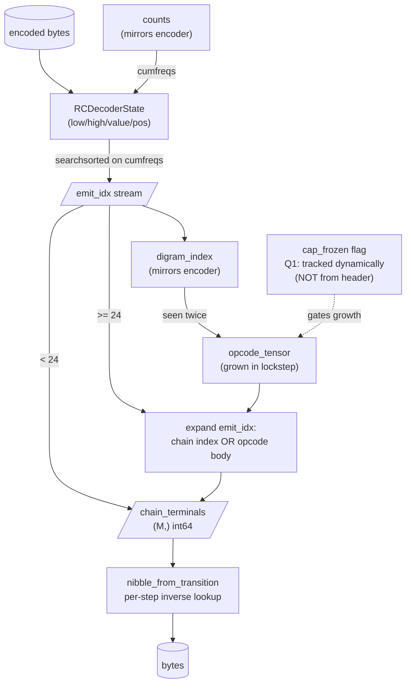
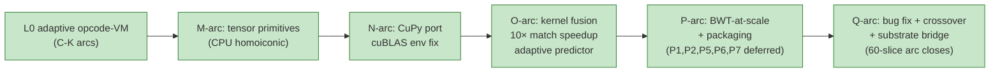
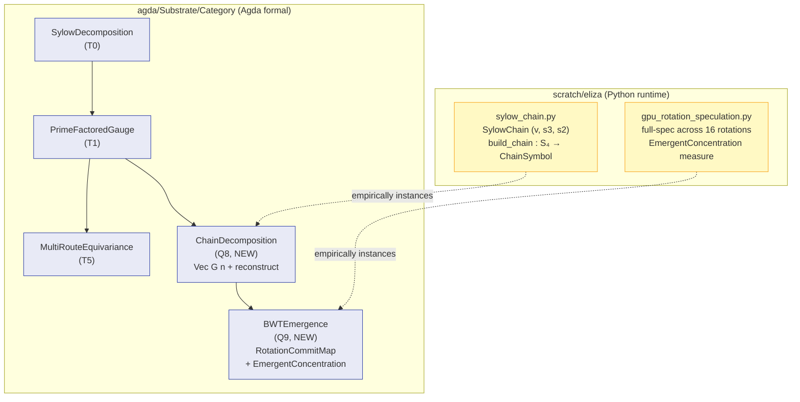
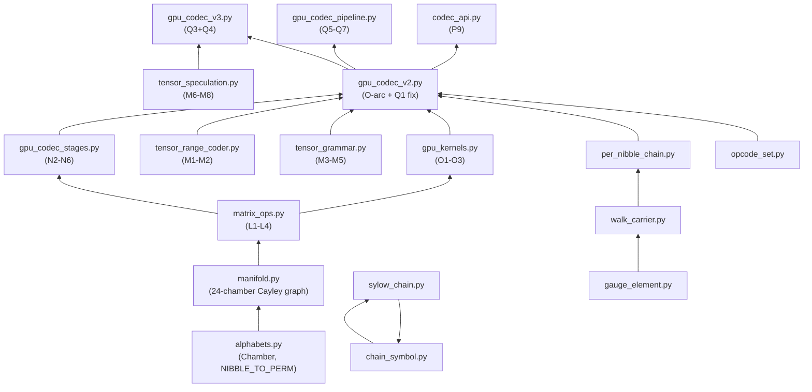

# Codec architecture flow — post-Q-arc

Post-60-slice arc (C through Q). Current production codec is **GpuCodecV2**; V3 wires speculation on top.

## Encoder dataflow

```mermaid
flowchart TB
    subgraph CPU["CPU side (control + range coder)"]
        bytes[("bytes")]
        rc["RCState<br/>(tensor: low/high/pending/buf)"]
        counts["counts: (alphabet_size,) np.int64<br/>(adaptive predictor)"]
        encoded[("encoded bytes")]
    end

    subgraph GPU["GPU side (tensor pipeline)"]
        walk["int_chamber_walk<br/>via next_chamber_table (24×16)<br/>O8 numerically exact"]
        chain[/"chain stream<br/>(N,) int64 chamber indices"/]
        opcodes[("opcode_tensor<br/>(max_opcodes, max_body)<br/>preallocated O6/O7")]
        match["gpu_opcode_match_vectorized<br/>O1: single CuPy launch<br/>(N_pos × N_opc) match-length"]
        match_t[/"match_tensor<br/>(N_pos, n_used) int64"/]
        argmax["xp.argmax(row[pos])<br/>O3 on-device"]
        spec{{"V3: speculation<br/>(StackTensor toggle)<br/>Q3+Q4"}}
        digram["digram_index dict<br/>(prev, this) → rule_id"]
        grow["try_grow_opcode<br/>+ gpu_opcode_match_append<br/>O2 incremental"]
    end

    bytes --> walk
    walk --> chain
    chain --> match
    opcodes --> match
    match --> match_t
    match_t --> argmax
    argmax --> spec
    spec -->|emit_idx| counts
    counts -->|cumfreqs via cumsum| rc
    rc --> encoded

    spec -->|digram event| digram
    digram -->|seen twice| grow
    grow -.->|append column<br/>(no full recompute)| match_t
    grow -.->|append body| opcodes

    classDef gpu fill:#e0f7fa,stroke:#00838f
    classDef cpu fill:#fff3e0,stroke:#e65100
    classDef bridge fill:#f3e5f5,stroke:#6a1b9a
    class walk,chain,opcodes,match,match_t,argmax,spec,digram,grow gpu
    class bytes,rc,counts,encoded cpu
```

## Decoder dataflow (mirror)



## Tensor I/O shapes (homoiconic representation)

```
chamber walk:       (N_chain,) int64                           -- O8 int lookup
opcode bodies:      (max_opcodes, max_body) int64              -- O7 dynamic
opcode lengths:     (max_opcodes,) int64
match tensor:       (N_chain, n_used) int64                    -- O1 vectorized
RC state:           (4,) uint32                                -- M1+M2
adaptive counts:    (alphabet_size,) int64                     -- O5
stack state:        (C, max_depth, 2) int8                     -- M6
speculation batch:  (C, max_steps) int64                       -- M7
```

## Sub-arc layering



## Substrate-side bridge (Q8+Q9)



## Module dependencies (Python side, post-Q-arc)



## Performance summary (post-Q-arc)

| size | L0 b/byte | L0 time | V2 b/byte | V2 time | ratio |
|------|-----------|---------|-----------|---------|-------|
| 1024 | 8.164 | 327ms | 8.164 | 1294ms | 3.96× slower |
| 2048 | 7.723 | 981ms | 7.723 | 1720ms | 1.75× slower |
| 4096 | 7.232 | 2553ms | 7.307 | 2738ms | 1.07× slower |
| **8192** | **6.644** | **6880ms** | **6.938** | **4065ms** | **0.59× — V2 FASTER** |

V2 crosses over L0 between 4KB and 8KB. At 8KB V2 GPU is 1.7× faster than L0 CPU; compression cost 0.3 b/byte from cap-freeze at 512 opcodes (Q7 streaming sidesteps via chunking).

## Cross-references

- `[[qarc-closure]]` — Q-arc completion memo
- `[[oarc-kernel-fusion]]` — O-arc vectorisation
- `[[gpu-matricised-codec]]` — N-arc GPU port
- `[[matricised-codec-pipeline]]` — M-arc CPU primitives
- `[[opcode-vm-codec]]` — L0 baseline
- `[[substrate-primitives-index]]` — substrate's categorical-primitive registry; Q8+Q9 land here
