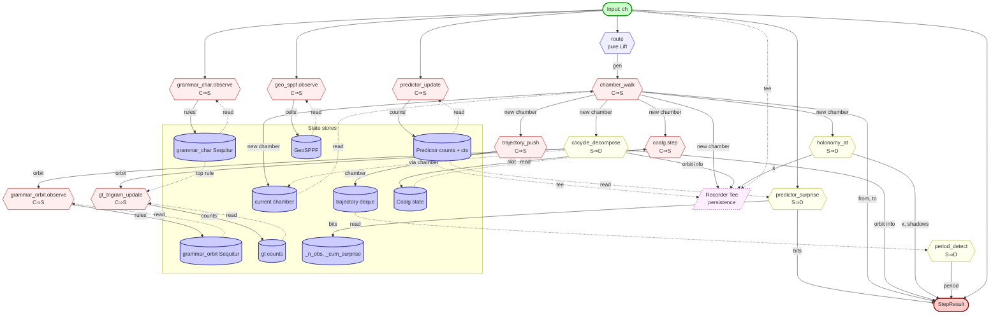

# Dataflow Remodel — Cross-Product Shadow Inventory

Applying `regroup-from-shadows` over three shadow sources:

- **A**: `agda/Substrate/` composition patterns.
- **B**: `scratch/eliza/` Python pipeline as-built.
- **C**: Build-process shadows (decisions, dead ends, surprises from the
  pass-1/pass-2/pass-3 conversation arc).

The cross-product reveals shadows visible in two or more sources, which
become candidates for extraction. The unifying abstraction is the
**Coxeter-Presentation pattern lifted to Python data flow**.

## Step 1: External commitments to preserve

The recomposition must hit every one of these:

- `Engine.step(ch)` signature and return shape (`StepResult`).
- `Engine.compression_stats()` dict shape (keys consumed by `run.py`).
- `run.py` CLI surface: `--bits`, `--crumbs`, `--nibbles`, `--binary`,
  `--compress`, `--ui`.
- Round-trip lossless for `codec.encode/decode`, `dim2_codec.encode/decode`.
- gt baseline numbers reproducible (within arithmetic-coding rounding).
- `v4_canonicalize=True` produces the same rule structure as today.
- `AGDA_BRIDGE.md` correspondences remain accurate.

## Step 2: Candidate shadows from the cross-product

### Shadow 1: **PARAMETRIC INSTANTIATION**

- **A (Agda)**: `Core` is opened with `Word + insert + obligations`.
  Each Coxeter instance (Z₂, Z₃, Z₄, V₄, FreeCyclic) is the SAME
  framework opened with a different parameter set.
- **B (Python)**: `Engine(vocab_size=N, router=R)` is a half-measure
  — only two parameters varied, the rest hard-coded.
- **C (Build)**: We kept adding modes (`--bits` → `--nibbles` →
  `--crumbs`) by adding branches in `run.py` and conditionals in
  `Engine.__init__`. Each new mode could have been an *instance* of
  the framework rather than a branch.

**Candidate abstraction**: `class Presentation(alphabet, router, …)`
that any input mode opens with concrete arguments.

### Shadow 2: **OBLIGATION-DRIVEN LIFTING**

- **A**: `WithLemmas` takes 2 per-instance proofs
  (`canonical-is-fixed`, `insert-append-lemma`) and derives every
  downstream lemma the Core needs.
- **B**: The 2 "obligations" are `predictor.surprise(ch)` and
  `predictor.update(ch)`. Every codec is built on top of these two
  methods; nothing else of the predictor is needed externally.
- **C (Build)**: We discovered the wrong way to extend a predictor
  (strip residue) and the right way (group acts on input). The shadow:
  the predictor's two-method *contract* is invariant; extensions live
  in the surrounding compositional structure.

**Candidate abstraction**: `class PredictorContract(surprise_bits,
update)` — a duck-typed interface. Predictors that satisfy it can be
swapped freely.

### Shadow 3: **DIRECTPRODUCT AS TRANSFORMER**

- **A**: `DirectProduct` takes two `Core`s and returns their product
  `Core` by lifting operations componentwise. The product inherits
  every framework lemma without re-proof.
- **B**: `dim2_codec.py` informally does this: one canonical predictor
  plus a rotation chooser. The chooser is the 2-cell.
- **C (Build)**: The framing arc landed on `DirectProduct(FreeCyclic_canonical,
  Z_16_rotations)`. This is recorded as a string in
  `stats["categorical_type"]` but **not realized as a runtime construct**.

**Candidate abstraction**: `class Product(layer_a, layer_b,
chooser)` — a parameterized transformer that composes two layers via
an explicit chooser.

### Shadow 4: **STATELESS NORMALIZER + STATE CARRIER**

- **A**: `normalize : Word → Word` is pure. State lives in the
  compositional context (the Word being passed around), not in the
  normalizer.
- **B**: `predictor.update()` is stateful; `arith.encode()` is
  stateful; chamber walk is stateful. State is pooled on `Engine`
  and inside each module.
- **C (Build)**: The 16-parallel-predictors mistake was a state-shape
  error — we tried to put rotation state in the predictor (multiplying
  it 16×) when it belongs in the *chooser layer*. State carriers
  needed explicit separation.

**Candidate abstraction**: Separate `transform(state, input) →
(state, output)` (pure functional style) from `Layer.run(input)`
(method-stateful style). Both are valid; the codebase mixes them.

### Shadow 5: **ADAPTER PATTERN** (V4 ↔ V4-Coxeter)

- **A**: `V4.agda` is a lightweight bijection layer between the
  4-constructor user type and the Coxeter-Word backend. Theorems
  proven on canonical Words lift to V₄ via `to-c-injective`.
- **B**: `dim2_codec` uses `TrigramPredictor` as backend; the chooser
  rotates the input before passing it to the predictor.
- **C (Build)**: Group action on input, not model. The chooser IS the
  adapter: input-space view ↔ canonical-space view.

**Candidate abstraction**: `class Adapter(canonical_layer, gauge)`
— a layer wrapping a canonical backend with a user-side gauge choice.

### Shadow 6: **NESTED PUBLIC RE-EXPORT**

- **A**: Z4-Coxeter opens ListPresentation, which opens WithLemmas,
  which opens Core — each with `public`. Obligations flow inward
  through the parameter list; lemmas flow outward through the chain
  of `public` opens.
- **B**: `Engine.compression_stats()` returns a flat dict aggregating
  outputs from `predictor`, `grammar_char`, `coalg`, `geo_sppf`,
  `holonomy`, etc. — Engine reaches inward into each module rather
  than each module re-exporting its statistics.
- **C (Build)**: Adding `coalg_total_bits`, `gtV4a_ratio`, etc., to the
  dict required modifying `Engine.compression_stats()` every time —
  inverse of the desired Agda-style flow.

**Candidate abstraction**: Each layer publishes its own stats; the
pipeline merges them. Adding a layer adds keys without touching the
top-level assembly.

### Shadow 7: **PRESENTATION PATTERN** (Core + atoms → instance)

- **A**: `ListPresentation` is the bridge between abstract `Core` and
  concrete instances. The pattern: take `(Gen, Canonical, ε, insert,
  insert-canonical)`, instantiate Core. Every Coxeter instance follows
  this shape.
- **B**: `codec.py` (vocab=256), `frame_codec_crumb.py` (vocab=4),
  bits-mode (vocab=2), nibbles-mode (vocab=16). Four parallel
  realizations of the same compression pattern, with separate code
  paths.
- **C (Build)**: The user repeatedly asked "operate at crumb level not
  byte level." The codec architecture is *almost* uniform across
  granularities but each has its own module — they don't share a
  ListPresentation-style skeleton.

**Candidate abstraction**: `class CodecPresentation(vocab_size, ...)`
— one codec skeleton, four instances. Each instance specifies its
alphabet adapter.

### Shadow 8: **PIPELINE AS DATA-FLOW DAG**

- **A**: Agda has no explicit data-flow primitive. Composition is
  term-level (nested function calls). The codebase doesn't *need* a
  flow representation because everything is stateless.
- **B**: `Engine.step()` IS a pipeline (11 layers, sequential) but
  it's a SEQUENCE OF STATEMENTS, not a representable data structure.
  You can't inspect the flow, you can only execute it.
- **C (Build)**: The user asked "what does the pipeline look like?"
  and "let's re-model this as a data flow." That's the gap: a
  Python project that's structurally a pipeline but has no
  first-class representation of itself.

**Candidate abstraction**: `class Pipeline(layers, edges)` — explicit
DAG with named edges and inspectable structure. Layers are nodes;
their type-signatures (inputs, outputs) drive edge validity.

## Step 3: Unifying abstraction

The eight candidate shadows quotient under a **single meta-pattern**:

```text
The Coxeter-Presentation pattern lifted to Python data flow.

  Skeleton                  =  abstract Layer interface (Core analog)
  Obligation set            =  per-instance methods the Layer requires
  Instance                  =  concrete Layer subclass / parameterization
  Combinator                =  Product transformer (DirectProduct analog)
  Adapter                   =  Layer wrapping with gauge choice
  Pipeline                  =  composed DAG of Layers (no Agda analog —
                                Python-specific)
```

Each shadow is one face of this pattern. The unifying claim: the codec
project's natural shape is **Agda-style layered parametric
instantiation, expressed as a Python flow DAG with explicit Layer
nodes, Product combinators, and Adapter wrappers**.

## Step 4: Recomposition — proposed data-flow diagram

```text
                       INPUT BYTES
                            │
                            ▼
                  ┌─────────────────────┐
                  │ AlphabetAdapter     │  ← parametric: vocab_size
                  │ (bits/crumbs/byte)  │
                  └──────────┬──────────┘
                             │ symbols
                             ▼
                  ┌─────────────────────┐
                  │ ChamberLayer        │  ← stateful: current_chamber
                  │ (router + walk)     │
                  └──────┬──────────────┘
                         │ (chamber, symbol)
                         ├───────────────┐
                         ▼               ▼
              ┌──────────────────┐  ┌────────────────────┐
              │ OrbitLayer       │  │ HolonomyLayer      │
              │ (V₄ cocycle)     │  │ (Beck-Chevalley κ) │
              └────────┬─────────┘  └────────┬───────────┘
                       │                     │
                       │  (orbit, fiber)     │  (κ, shadows)
                       │                     │
                       └───────┬─────────────┘
                               │
                               ▼
                  ┌──────────────────────┐
                  │ Product Combinator   │  ← composes:
                  │ (canonical_predictor │     Input  → bytes
                  │  × Z₁₆ chooser)      │     Group  → rotation
                  │                      │     Output → emit + tag
                  └────────┬─────────────┘
                           │ (emit_byte, rotation_idx)
                           ├──────────┐
                           ▼          ▼
                  ┌──────────────┐  ┌──────────────┐
                  │ GrammarLayer │  │ CoalgLayer   │
                  │ (Sequitur)   │  │ (slot stream)│
                  └──────┬───────┘  └──────┬───────┘
                         │                  │
                         ▼                  ▼
                   rule library      slot histogram
                         │                  │
                         └──────┬───────────┘
                                ▼
                       ┌──────────────────┐
                       │ ArithCodec       │  ← stateful: range coder
                       │ (range encoder)  │
                       └────────┬─────────┘
                                ▼
                          BIT STREAM
```

Each box is a `Layer`. Each edge is a typed carrier (named tuple of
state + symbol). Products (boxes with `×` in them) are combinators.
The Pipeline is the DAG of layers + edges.

Each `Layer` has:

- **inputs**: list of carrier types it consumes.
- **outputs**: list of carrier types it produces.
- **state**: optional mutable carrier the layer owns.
- **step(carrier_in) → carrier_out**: the per-tick operation.
- **stats() → dict**: the layer's contribution to compression_stats.

`Engine` becomes a thin wrapper that holds a `Pipeline` and dispatches
input through it. `compression_stats` is a merge of every layer's
`stats()` — adding a layer no longer touches Engine code.

## Step 5: Recomposition plan — what to extract

Recomposition is non-trivial. Outcome 3 of `regroup-from-shadows`
applies: shadows identified and documented, recomposition deferred to
a future session.

Concrete first refactor (a future session's first 5 slices):

1. **Define `Layer` protocol** in `eliza/layer.py`. Methods:
   `step(carrier) -> carrier`, `stats() -> dict`, `name`.
2. **Define `Pipeline` class** in `eliza/pipeline.py`. Holds an
   ordered list of layers; dispatches `step()` by chaining; merges
   `stats()` dicts.
3. **Extract `ChamberLayer`** wrapping the
   `router → manifold.apply → cocycle.info → holonomy.at` quadruple
   that currently lives inline in `Engine.step()`. Round-trip-stable
   tests: gt baseline numbers must match.
4. **Extract `PredictorLayer`** wrapping `TrigramPredictor`. The
   layer owns the predictor; `Engine` references the layer's `state`.
5. **Replace `Engine.step()`** with `pipeline.step(input)`. Should be
   a behaviour-preserving substitution.

After these 5, the codec layers (`grammar`, `coalg`, `geo_sppf`,
`dim2`) extract analogously. The `Product` combinator (for dim2's
canonical predictor + chooser) lands as slice 6. The `Pipeline` is
inspectable; `pipeline.show()` produces the ASCII diagram above.

## Step 6: Behaviour preservation strategy

Before any extraction, capture a baseline:

```bash
head -c 5000 /tmp/text.bin | python run.py --stdin --compress > /tmp/baseline.txt
```

After each extraction, re-run and diff. Any change in
`compression_stats` keys/values means the extraction lost information.

The 2-cell round-trip tests (`codec.encode/decode`, `dim2.encode/decode`)
must continue to pass byte-exact.

## Step 7: What this preserves (the invariants)

- **Layered parametric instantiation**: matches Agda's pattern.
- **Pure transformers vs stateful carriers**: matches the
  `normalize`-style decomposition.
- **Combinators as transformers, not features**: `Product` is a
  first-class construct, not a special case.
- **Adapters as gauge choices**: the chooser is an Adapter wrapping a
  canonical Layer.
- **Stats flow outward**: each layer publishes its own; Engine doesn't
  reach in.
- **The pipeline is data, not code**: inspectable, serializable, and
  parameterizable.

## Step 8: Bridge to substrate's existing formalism

The substrate's `Substrate.Groups.Coxeter.*` family IS the
type-theoretic shadow of this Python architecture. The translation:

| Substrate Coxeter | Python Layer Architecture |
| --- | --- |
| `Coxeter.Word` | the alphabet adapter's output type |
| `Coxeter.Core` | the abstract `Layer` protocol |
| `ListPresentation` | a concrete `Layer` for the byte/crumb/nibble case |
| `WithLemmas` | the layer's `stats()` contract |
| `DirectProduct` | the `Product` combinator |
| `V4` adapter | the `Adapter` wrapping a canonical layer with a gauge |
| Z₂/Z₃/Z₄/V₄ instances | one `AlphabetAdapter` instance per input mode |
| `FreeCyclic-Coxeter` | the `GrammarLayer` (Sequitur over the input alphabet) |

A `Pipeline` whose layers correspond cell-by-cell to Coxeter
instantiations is the codec architecture's **algebraic shape made
runtime-explicit**. The Agda formalism becomes the type-checker for
the Python pipeline's structural commitments.

## Status

- **Outcome**: Outcome 3 (shadow identification + documented
  recomposition plan). Recomposition not executed in this session.
- **Shadows registered**: 8, with cross-source provenance.
- **Unifying abstraction**: identified (Coxeter-Presentation lifted to
  Python data flow).
- **Recomposition first 5 slices**: documented; ready for execution
  in a future session.
- **External commitments**: preserved (none touched in this session;
  the refactor is described, not begun).

The shadows persist in this document. A future session can either
execute the recomposition or extend the shadow inventory further.

---

## Decompose-by-Entailment sub-analysis

Re-applying `decomposable-by-entailment` to each of the 8 shadows
individually. For each, the four DBE questions: (1) what's the
costructure, (2) what's the composition operation, (3) what's the
entailment, (4) what sub-shadows fall out.

Then quotient across the per-shadow sub-decompositions for cross-shadow
sub-shadows — the deeper layer.

### Per-shadow decompositions

#### Shadow 1: Parametric Instantiation

- **Target**: A uniform way to open a skeleton with instance parameters.
- **Costructure**: A `ParameterSet` — a typed bundle of values that
  match the skeleton's parameter signature. Each parameter is itself
  a typed value with its own validity.
- **Composition**: `skeleton.open(params)` — invocation of the
  skeleton's parameter-list.
- **Entailment**: `valid(params) ⇒ valid(skeleton.open(params))`. The
  skeleton trusts the parameters; if each parameter satisfies its
  type contract, the instance is valid.
- **Sub-shadow**: `ParameterSet` is itself decomposable. Each
  parameter is a (name, type, validator) triple. The set is a
  heterogeneous record.

#### Shadow 2: Obligation-Driven Lifting

- **Target**: From a small obligation set, derive a large method set.
- **Costructure**: An `Obligation` — a single (signature, invariant)
  pair the instance must provide.
- **Composition**: `WithLemmas(obligation₁, …, obligation_n) → derived
  methods`. The lifting is functorial: each obligation contributes one
  layer of derivable lemmas.
- **Entailment**: `(∀ i. valid(obligation_i)) ⇒ valid(derived)`.
- **Sub-shadow**: each `Obligation` decomposes into (input-types,
  output-type, invariant-property). The invariant is itself a
  proposition (or a runtime check, in Python).

#### Shadow 3: DirectProduct as Transformer

- **Target**: Combine two `Layer`s into a `Product`.
- **Costructure**: A `Chooser` — the 2-cell that selects between
  the two layers' outputs.
- **Composition**: `Product(layer_a, layer_b, chooser).step(x) =
  chooser(layer_a.step(x), layer_b.step(x))`.
- **Entailment**: round-trip correctness of the product follows from
  round-trip of each layer plus the chooser's well-definedness.
- **Sub-shadows**: the `Chooser` decomposes into three named pieces:
  1. **ScoreFn**: `(candidate, context) → cost` — how to evaluate.
  2. **SelectionRule**: `scores → selected_idx` — typically argmin.
  3. **Coupling**: `(selected_idx, output_from_a) → input_to_b` — how
     a's choice affects b's input.
  Each is a separate small layer-like construct.

#### Shadow 4: Stateless Normalizer + State Carrier

- **Target**: Separate pure transformations from stateful evolution.
- **Costructure**: A `Carrier` — an immutable state snapshot.
- **Composition**: `evolve(carrier, transform) = transform(carrier) →
  new_carrier`. Sequencing is `foldl evolve seed transforms`.
- **Entailment**: state evolution is deterministic given the seed and
  the sequence of transforms — referential transparency.
- **Sub-shadow**: the lens pattern. Each transform decomposes into
  (read, compute, write) over the carrier — a `Lens(get, set)` plus a
  `compute(read_value) → write_value`. Three pieces; one of the
  cleanest known sub-decompositions.

#### Shadow 5: Adapter (gauge wrapping)

- **Target**: Wrap a canonical `Layer` with a gauge choice.
- **Costructure**: A `Gauge` — a group action on the input space.
- **Composition**: `Adapter(canonical, gauge).step(x) =
  gauge.inverse(canonical.step(gauge.forward(x)))`.
- **Entailment**: round-trip stable iff `gauge.inverse ∘ gauge.forward
  = id` (the gauge is invertible).
- **Sub-shadows**: the `Gauge` decomposes into:
  1. **ForwardMap**: `input_space → canonical_space`.
  2. **BackwardMap**: `canonical_space → input_space`.
  3. **InversenessProof** (or runtime invariant): `backward ∘ forward
     = identity`.
  This is structurally **the Galois insertion** — a known categorical
  primitive. Naming the right thing reveals it's already in the
  literature.

#### Shadow 6: Nested Public Re-export

- **Target**: Each layer publishes its own outputs; the pipeline
  merges. No "all-knowing assembler".
- **Costructure**: A `StatsContract` — the typed dict shape each
  layer publishes.
- **Composition**: `pipeline.stats = merge(layer_i.stats for i)`. The
  merge is a typed dict union with no key collisions.
- **Entailment**: if every layer's `stats` matches its declared
  contract, the merged stats matches the union of all contracts.
- **Sub-shadow**: the `StatsContract` itself decomposes into a record
  type. Same shape as `ParameterSet` in Shadow 1 — both are
  heterogeneous records. **Cross-shadow quotient noted.**

#### Shadow 7: Presentation Pattern

- **Target**: One skeleton, many instances; instances vary in their
  parameter set but share the framework.
- **Costructure**: A `Skeleton` + a `ParameterSet`. Identical to
  Shadow 1's setup.
- **Composition**: `instantiate(skeleton, params)`.
- **Entailment**: same as Shadow 1.
- **Sub-shadow**: this IS Shadow 1 at a different naming. **Shadows
  1 and 7 quotient.**

#### Shadow 8: Pipeline as Data-Flow DAG

- **Target**: Make the pipeline's structure inspectable as a graph.
- **Costructure**: An `EdgeType` — the typed carrier between two
  layers. Plus a `Topology` — the graph structure.
- **Composition**: `Pipeline(layers, edges) =
  fold-over-edges-in-topological-order`.
- **Entailment**: `(∀ edge. edge.source.output_type = edge.target.
  input_type) ⇒ valid(pipeline)`. Type-check the edges.
- **Sub-shadows**:
  1. **Topology**: the graph structure as a pure data type (nodes +
     edges, no semantics).
  2. **EdgeType**: the typed-carrier contract for each edge.
  3. **TopoSort**: the ordering operation that linearizes the DAG.
  Three separable concerns.

### Cross-shadow quotients (the deeper layer)

Looking across the 8 per-shadow decompositions, sub-shadows fall into
clusters that quotient:

#### Quotient α: Heterogeneous Records

Shadow 1's `ParameterSet`, Shadow 6's `StatsContract`. Both are typed
records over a namespace. **Single sub-shadow**: `HRecord` — a
heterogeneous, typed key-value map with field validation.

#### Quotient β: Galois Insertions

Shadow 3's `Coupling`, Shadow 5's `Gauge`. Both are pairs `(forward,
backward)` with an inverseness condition. **Single sub-shadow**:
`Galois` — a pair-of-arrows-with-inverseness primitive.

#### Quotient γ: Contracts

Shadow 2's `Obligation`, Shadow 8's `EdgeType`. Both are typed
interfaces a piece of code must implement. **Single sub-shadow**:
`TypedContract` — a (signature, invariant) pair.

#### Quotient δ: Functional Decomposition

Shadow 3's `(Score, Selection, Coupling)`, Shadow 4's
`Lens(get, set) + compute`, Shadow 8's
`(Topology, EdgeType, TopoSort)`. All three are three-part
decompositions of a composite operation. **Cross-shadow sub-shadow**:
each composite has a **read / compute / write** triple shape — the
lens-of-operations pattern.

### The deeper unifying meta-shadow

Quotienting further: the four cross-shadow sub-shadows themselves all
share one shape:

```text
TypedContract       = (input-type, output-type, invariant)
HRecord             = field × TypedContract
Galois              = ⟨forward, backward, inverseness⟩
ReadComputeWrite    = ⟨read, compute, write⟩
```

Each is a **named tuple-of-arrows-and-conditions**. The deeper
meta-shadow is:

> **Algebraic interfaces as named tuples-of-arrows with one
> coherence condition.**

This is the **categorical primitive** of an algebraic theory's
signature: a finite set of operations (arrows) plus a finite set of
equations (coherence). Every shadow in the 8-list is an instance.

### Recursive metacircularity

The decomposition of the 8 shadows produced 4 cross-shadow
sub-shadows, which themselves quotient into 1 meta-meta-shadow.
Applying DBE again to the meta-meta-shadow:

- **Target**: a tuple-of-arrows-with-coherence.
- **Costructure**: each individual arrow (= a `TypedContract`).
- **Composition**: bundling arrows into a tuple + adding the
  coherence condition.
- **Entailment**: if each arrow is valid and the coherence holds, the
  bundled algebraic interface is valid.

This sub-decomposition is **the same shape**: a tuple-of-arrows-with-
coherence. The meta-meta-shadow IS its own sub-shadow.

This is the **subcoalgebra fixed point** — the point at which DBE
stops reducing further because the target equals its own costructure.
The substrate's tetrative metacircularity (`project_tetrative_meta
circularity` in memory) explicitly predicts this: each meta-level
instantiates the same 3+1 parity universal at a higher rung; the
recursion's fixed point is the universal itself.

**The 8 codec shadows are all instances of the categorical-algebraic-
interface primitive, applied at different scales of the codec
architecture.**

### Implications for recomposition

The 5-slice plan in the earlier section becomes more precise with
sub-shadows named:

1. **`Layer` protocol** = `TypedContract(input_type, output_type,
   invariant)` × `state: Carrier` × `stats: HRecord`.
2. **`Pipeline`** = `Topology` × `EdgeType` × `TopoSort`.
3. **`ChamberLayer`** extraction = an `Adapter(canonical=Manifold,
   gauge=Router)` with `Galois(forward=route, backward=route_inverse)`.
4. **`PredictorLayer`** extraction = a `Lens(get_context,
   set_context)` + a `compute(context, ch) → surprise`.
5. **`Engine.step` swap** = `TopoSort(layers).fold(input)` with explicit
   state carriers.

The `Product` combinator (slice 6) becomes:
`Product(layer_a, layer_b, chooser=Chooser(score, selection, coupling))`.

Each sub-shadow is small enough to implement in one slice; cross-shadow
sub-shadows (`HRecord`, `Galois`, `TypedContract`, `ReadComputeWrite`)
are shared utilities that every layer-implementation will use.

### What this analysis added

Before DBE-on-shadows:

- 8 shadows identified.
- Unifying abstraction: "Coxeter-Presentation lifted to Python".
- Recomposition plan: 5 slices, each somewhat ambiguous in
  implementation.

After DBE-on-shadows:

- 8 shadows decomposed into ~16 sub-shadows.
- 4 cross-shadow quotients (`HRecord`, `Galois`, `TypedContract`,
  `ReadComputeWrite`).
- 1 meta-meta-shadow (algebraic-interface-as-tuple).
- Recomposition plan's 5 slices now name **concrete sub-shadow
  utilities** as their building blocks; each slice is a specific
  composition of identified primitives rather than an open-ended
  refactor.

The shadow inventory is now **categorically structured**: every
construct in the future Pipeline architecture is an instance of the
algebraic-interface primitive, applied at a specific level. The
implementation work is composing instances, not designing new shapes.

### Lego brick catalog

The 5-slice plan is too coarse for mix-and-match composition. Below is
the per-brick catalog: every analysis algorithm and every data
structure as a named dataflow role with explicit type signature. A
pipeline is built by selecting bricks from this catalog and connecting
them via the combinators in Section E.

Roles (every brick has one, used to validate composition):

- **Source**: produces values from an external input. No state input,
  no upstream brick.
- **Sink**: consumes values to an external output. No state output, no
  downstream brick.
- **Transform**: pure function, no state. Input types → output types.
- **Step**: state × input → state × output. Stateful.
- **Read**: state → readout. Read-only on state; produces no
  state-output.
- **Store**: holds state; provides read/update primitives.
- **Combinator**: takes one or more bricks and produces a new brick.
- **Splitter**: one stream → many; broadcast or fan-out.
- **Tee**: one stream → continue + side-effect (e.g., logging).
- **Aggregator**: many streams → one (merge, sum, etc.).

#### A. Atomic transforms (Transform role)

Pure functions; no state, no side effects.

| Brick | Signature | Source module |
| --- | --- | --- |
| `route` | `Char → Gen` or `Char → Perm` | `router.py` |
| `chamber_apply_gen` | `Chamber × Gen → Chamber` | `manifold.py` |
| `chamber_apply_perm` | `Chamber × Perm → Chamber` | `alphabets.perm_compose` |
| `cocycle_decompose` | `Chamber → (Orbit, Fiber, Chirality)` | `orbit.Cocycle.info` |
| `holonomy_at` | `Chamber → HolonomyReading` | `holonomy.py` |
| `period_detect` | `Trajectory → Optional[Period]` | `trajectory.py` |
| `v4_rotate_crumb` | `Crumb × V4Label → Crumb` | (implicit XOR) |
| `octonion_rotate_byte` | `Byte × RotIdx → Byte` | `octonion.rotate_byte` |
| `signature_compute` | `Window × Depth → Histogram` | `signature.signature` |
| `signature_entropy` | `Histogram → Bits` | `signature.signature_entropy` |
| `signature_quantize` | `Histogram × Levels → Histogram` | `signature.quantize` |
| `nibble_split` | `Byte → (Nibble, Nibble)` | (in `run.py`) |
| `crumb_split_sliding` | `Bits → Iter[Crumb]` | `codec.bits_to_crumbs` |
| `crumb_split_tiled` | `Bits → Iter[Crumb]` | (in `run.py` non-sliding mode) |
| `counts_to_cumfreqs` | `Counts × Vocab → CumFreqs` | `codec._cumfreqs_from_predictor` |
| `nt_invert` | `NT → NT` | `sequitur.Sequitur._invert_sym_v4` |
| `digram_canonicalize` | `(Sym, Sym) → (Canon, Residue)` | `sequitur.Sequitur._canonical_digram` |
| `huffman_codes` | `Counts → CodeTable` | `engine._huffman_code_lengths` |
| `v4_closure_boundary` | `Bits → List[Pos]` | `windows.closure_positions` |
| `geo_sppf_cell_addr` | `Chamber → CellId` | `geo_sequitur.py` |
| `score_rotation` | `Window × Predictor → Cost` | `dim2_codec._score_rotation` |
| `argmin` | `List[Cost] → Idx` | builtin |
| `merge_stats` | `List[HRecord] → HRecord` | (not yet extracted) |

#### B. Data structures (Store role's content)

Each is a named carrier with invariants. Stores in C wrap these.

| Type | Shape | Invariant |
| --- | --- | --- |
| `Chamber` | 4-tuple permutation | each ∈ {1..4}, all distinct |
| `Gen` | enum {s1, s2, s3} | (none) |
| `V4Label` | {e, α, β, γ} | self-inverse |
| `OrbitLabel` | str (canonical word) | one of 6 |
| `TrigramCounts` | `Dict[(Sym,Sym), Dict[Sym,int]]` | counts ≥ 0 |
| `SequiturGrammar` | rules + digram-index + back-refs + top-rule | digram uniqueness, rule utility |
| `NT` | `(rule_id, residue)` frozen | `residue` ∈ V₄ |
| `RangeCoderState` | `(low, high, pending_bits, buf)` | `low ≤ high` |
| `TrajectoryWindow` | `Deque[Chamber, maxlen=24]` | bounded |
| `Signature` | `Tuple[int, ...]` (depth-d) | sum = window_size |
| `CumFreqs` | `List[int]` | non-decreasing, last = total |
| `Frame` | `IFrame | PFrame | PatchFrame | BFrame` | (per variant) |
| `StatsHRecord` | `Dict[str, scalar | HRecord]` | no key collision under merge |
| `RotationTag` | `int ∈ [0, 16)` | (none) |
| `CoxeterWord` | `List[Gen]` | (none until normalize) |

#### C. Stateful steps (Step role)

Each takes a Store + input and updates the store.

| Brick | Signature | Source module |
| --- | --- | --- |
| `predictor_update` | `(Counts, Context) × Char → (Counts', Context')` | `predictor.update` |
| `predictor_surprise` | `(Counts, Context) × Char → Bits` (read-only) | `predictor.surprise_bits` |
| `sequitur_observe` | `Grammar × Sym → Grammar'` | `sequitur.observe` |
| `range_encode_sym` | `RCState × (CumFreqs, Idx, Total) → (RCState', MaybeBits)` | `arith.RangeEncoder.encode` |
| `range_decode_sym` | `RCState × (CumFreqs, Total) → (RCState', Idx)` | `arith.RangeDecoder.decode` |
| `range_finish` | `RCState → Bytes` | `arith.RangeEncoder.finish` |
| `chamber_walk_step` | `Walk × Gen → Walk'` | (Engine.step inline) |
| `trajectory_push` | `Traj × Chamber → Traj'` | (Engine.step inline) |
| `geo_sppf_observe` | `GeoSPPF × Sym → GeoSPPF'` | `geo_sequitur.observe` |
| `coalg_step` | `CoalgState × Chamber → (CoalgState', SlotBits)` | `coalgebraic.CoalgebraicCodec.step` |

#### D. Analyses (Read role)

Read-only over a Store; produce summary readouts. These are what feed
`compression_stats`.

| Brick | Signature | Source module |
| --- | --- | --- |
| `gt_cost_of_top` | `Grammar × Counts → Bits` | `engine._grammar_trigram_cost_of_top` |
| `gt_costs_of_top` | `Grammar × MultiCounts → (Cost, ..., CyclingRate)` | `engine._gt_costs_of_top` |
| `huffman_bits` | `Grammar → Bits` | `engine._huffman_grammar_bits` |
| `orbit_cycling_rate` | `Trajectory → Float` | (inline in costs_of_top) |
| `n_rules` | `Grammar → Int` | `sequitur.n_rules` |
| `n_nt_refs` | `Grammar → Int` | `sequitur.n_nt_refs` |
| `top_predictions` | `Counts → List[(Sym, Prob)]` | `predictor.top_predictions` |
| `cell_population` | `GeoSPPF → Dict[Cell, Count]` | `geo_sequitur.cell_population` |
| `slot_stream` | `CoalgState → List[Slot]` | `coalgebraic.slot_stream` |

#### E. Combinators (Combinator role)

Take bricks; return composite bricks. These ARE the architectural
primitives identified by the DBE cross-shadow quotients.

| Combinator | Signature | What it builds |
| --- | --- | --- |
| `Adapter(canonical, gauge)` | `Layer × Galois → Layer` | Layer wrapping a canonical backend with a user-side gauge (e.g., `ChamberLayer = Adapter(Manifold, Router)`) |
| `Product(a, b, chooser)` | `Layer × Layer × Chooser → Layer` | Two-Sequitur dim-2 codec, with chooser as 2-cell |
| `Chooser(score, selection, coupling)` | `(Score, Selection, Coupling) → Chooser` | The 2-cell decomposition from Shadow 3 |
| `Galois(forward, backward)` | `Arrow × Arrow → Galois` | Invertible-pair primitive |
| `Lens(get, set)` | `(Read, Write) → Lens` | State-access primitive |
| `Pipeline(layers, edges)` | `List[Layer] × List[Edge] → Pipeline` | DAG of layers with typed edges |
| `Tee(layer, observer)` | `Layer × Observer → Layer` | Pass-through with side-channel observation (e.g., for recorder, logger) |
| `Tap(layer, name)` | `Layer × String → (Layer, Reader)` | Names a stream so it can be referenced elsewhere |
| `WithStats(layer, emit)` | `Layer × StatsContract → Layer` | Decorator adding the layer's stats output to its public surface |
| `Lift(transform)` | `Transform → Layer` | Promote a pure transform (Section A) to a no-state Layer |

#### F. Higher-order shape patterns

These are the four cross-shadow sub-shadows identified earlier; they
underlie multiple bricks in A–E.

- `TypedContract(input, output, invariant)` — every brick's
  type-signature has this shape.
- `HRecord(field → TypedContract)` — for stats, parameters, and any
  heterogeneous record.
- `Galois(forward, backward, inverseness)` — every gauge, every
  invertible adapter, every round-trip pair.
- `ReadComputeWrite(read, compute, write)` — every triple-shape
  decomposition (Chooser, Lens, Pipeline-node-internals).

#### Composition examples

How existing operations decompose into bricks:

**`Engine.step(ch)` (currently 11-statement procedure):**

```text
Pipeline(
  layers = [
    Lift(route),                              # A.route
    chamber_walk_step,                        # C.chamber_walk_step
    Tee(Lift(cocycle_decompose), observer),   # A.cocycle + Tee
    Tee(Lift(holonomy_at), observer),         # A.holonomy
    Lift(period_detect),                      # A.period_detect
    predictor_update,                         # C.predictor_update
    Tee(coalg_step, slot_observer),           # C.coalg_step
    sequitur_observe,                         # C.sequitur_observe (char)
    sequitur_observe,                         # C.sequitur_observe (orbit)
    geo_sppf_observe,                         # C.geo_sppf_observe
  ],
  edges = (typed-by-construction from each layer's I/O)
)
```

**`dim2_codec.encode` (currently per-window loop):**

```text
Pipeline(
  layers = [
    WindowPartition(size=256),                # not yet a brick — splitter
    Adapter(
      canonical = Pipeline([
        predictor_update,                     # C
        Lift(counts_to_cumfreqs),             # A
        range_encode_sym,                     # C
      ]),
      gauge = Galois(
        forward = Lift(octonion_rotate_byte),
        backward = Lift(octonion_rotate_byte),   # self-inverse
      ),
    ),
    Tee(sequitur_observe, rotation_sequitur), # C — second Sequitur
    range_finish,                             # C terminator
  ],
)
```

**`compression_stats()` (currently big dict-assembly):**

```text
Aggregator(
  taps = [
    Tap(predictor_layer.stats, "trigram"),
    Tap(sequitur_layer.stats, "grammar"),
    Tap(gt_layer.stats, "grammar-trigram"),
    Tap(coalg_layer.stats, "coalgebraic"),
    Tap(geo_sppf_layer.stats, "geo-sppf"),
  ],
  merge = merge_stats,                        # A — pure transform
)
```

#### Why this granularity matters

- Every brick is **independently swappable**. Switching from
  `predictor_update` (TrigramPredictor) to a Sequitur-aware predictor
  is changing ONE brick in a pipeline, not rewriting `Engine.step`.
- Every combinator is **independently composable**. Adding a second
  Sequitur is an instance of `Product` + `Chooser`, no new code paths.
- Every analysis is **independently named**. Adding a new compression
  metric is registering one `Read` brick in the aggregator, no
  modification to upstream layers.
- Compositions are **inspectable** as data. `pipeline.show()` produces
  the diagram automatically; `pipeline.bricks` enumerates the
  components.
- The bricks are the **lego pieces**; combinators are the connector
  studs. The Pipeline is just a particular Lego construction.

The catalog above currently has **~50 bricks** identified across
A–F. The codec's full architecture is some composition of these,
plus a small number of bricks we haven't built yet (`WindowPartition`,
`merge_stats`, `Tap`, `Tee`). After extraction, the implementation
size shouldn't grow — most bricks already exist as named functions
or methods; the work is naming them as bricks and routing them via
the combinator surface.

### Three-axis brick schema (the substrate's triangle)

Every brick lives in a **triangular categorical structure** with three
sorts:

- **D** — Data: values flowing through (bytes, crumbs, signatures, slots,
  surprise bits, ...).
- **S** — State: carriers being read/written (predictor counts, grammar,
  chamber, range-coder, ...).
- **C** — Compute: the algorithm being applied (route, rotate, update,
  observe, encode, ...).

A morphism between any two axes is **witnessed by the third**. This is
the substrate's organising principle, applied at the codec layer:

| Morphism | Witnessed by | What it means |
| --- | --- | --- |
| D → S | C | data becomes state — the compute is the write algorithm |
| S → D | C | state produces data — the compute is the read algorithm |
| D → C | S | data selects compute — the state remembers the choice |
| C → D | S | compute produces data — the state holds intermediates |
| S → C | D | state determines compute — the data triggers the transition |
| C → S | D | compute mutates state — the data parameterises the mutation |

Each brick is a **typed 2-cell** in this structure with five labels:

```text
                       brick
                  ┌─────────────────┐
            D_in →│                 │→ D_out
                  │  C: the compute │
            S_in →│                 │→ S_out
                  └─────────────────┘

  Three edges per brick:
    D = (D_in, D_out)      — Data edge
    S = (S_in, S_out)      — State edge
    C = the algorithm       — Compute edge

  Brick behaviour: C maps (D_in, S_in) → (D_out, S_out).
  Brick witnessing: C is the witness for the D ↔ S morphism the brick
    instantiates. The other four witnessings (D↔C, S↔C) are inherited
    from the brick's neighbours in the pipeline.
```

#### Homomorphism requirement

A brick is **homomorphic** if its compute C preserves the algebraic
structure of its D and S edges. Concretely:

- If D carries a monoid structure (e.g., bit-strings under concatenation),
  C must respect it: `C(d₁ ⊕ d₂, s) = C(d₁, s) ⊕ C(d₂, s')` for some
  derivable s'.
- If S carries a group structure (e.g., chambers under generator action),
  C must be equivariant: `C(d, g · s) = g · C(d, s)` where the action
  is consistent.
- If C is a composition of sub-bricks, those sub-bricks' homomorphism
  properties compose.

Most existing bricks ARE homomorphic; the schema makes this explicit so
violations become visible.

#### Bricks re-cataloged with three-axis types

Each brick declares `(D_in, D_out, S_in, S_out)`. The C is the brick's
name. Witnessing column shows the primary morphism the brick instantiates.

**Pure transforms (`S_in = S_out = ⊤`, no state)**:

| Brick | D_in | D_out | Primary witnessing | Homomorphism preserved |
| --- | --- | --- | --- | --- |
| `route` | Char | Gen | C bridges D₁ → D₂ | char-class partition |
| `chamber_apply_gen` | Chamber × Gen | Chamber | C bridges D₁ → D₂ | S₄ group action |
| `cocycle_decompose` | Chamber | (Orbit, Fiber) | C bridges D₁ → D₂ | V₄ quotient |
| `octonion_rotate_byte` | Byte × RotIdx | Byte | C bridges D₁ → D₂ | F₂³ × F₂ group action |
| `v4_rotate_crumb` | Crumb × V4Label | Crumb | C bridges D₁ → D₂ | V₄ XOR-action |
| `signature_compute` | Window × Depth | Histogram | C bridges D₁ → D₂ | prefix-tree refinement |
| `signature_entropy` | Histogram | Bits | C bridges D₁ → D₂ | Shannon (concave) |
| `counts_to_cumfreqs` | Counts × Vocab | CumFreqs | C bridges D₁ → D₂ | monotone, cumulative |
| `digram_canonicalize` | (Sym, Sym) | (Canon, Residue) | C bridges D₁ → D₂ | V₄ orbit canonical |
| `argmin` | List[Cost] | Idx | C bridges D₁ → D₂ | total-order respecting |

For these, S is unused (or = ⊤). The C witnesses D₁ → D₂ alone.

**State updates (`D_out ⊆ D_in`, write-mostly)**:

| Brick | D_in | S_in | S_out | Primary witnessing |
| --- | --- | --- | --- | --- |
| `predictor_update` | Char | TrigramCounts | TrigramCounts' | C: D→S (witness for update) |
| `sequitur_observe` | Sym | Grammar | Grammar' | C: D→S |
| `chamber_walk_step` | Gen | Walk | Walk' | C: D→S |
| `trajectory_push` | Chamber | Trajectory | Trajectory' | C: D→S |
| `range_encode_sym` | (CumFreqs, Idx) | RCState | RCState' (+ bits) | C: D→S, D as parameters |

These have meaningful S_in and S_out. The C witnesses how D updates S.

**State queries (`D_out` ⊋ `D_in`, read-only)**:

| Brick | D_in | D_out | S_in | Primary witnessing |
| --- | --- | --- | --- | --- |
| `predictor_surprise` | Char | Bits | TrigramCounts | C: S→D (read) |
| `sequitur_top_rule` | (none) | List[Sym] | Grammar | C: S→D (project) |
| `gt_cost_of_top` | (none) | Bits | (Grammar, Counts) | C: S→D (aggregate) |
| `n_rules` | (none) | Int | Grammar | C: S→D (project) |
| `cell_population` | (none) | Histogram | GeoSPPF | C: S→D (project) |

S_out = S_in for queries (read-only). The C witnesses how S projects to D.

**Computation-choosers (`D_in` selects compute, `S_out` records choice)**:

| Brick | D_in | D_out | S_in | S_out | Primary witnessing |
| --- | --- | --- | --- | --- | --- |
| `score_rotation` | Window | List[Cost] | Predictor (R/O) | (unchanged) | C: D→C (eval all candidates) |
| `choose_rotation` | Window | RotIdx | (Predictor, Cache) | (Cache + Idx) | C: D→C, S records choice |
| `frame_chooser` | Window | Frame | (Predictor, RefLib) | RefLib + Frame | C: D→C, S records reference |

These witness the Data → Compute morphism (data selects which compute
applies). The State holds the **choice** as the witness.

**State-driven dispatch (`S_in` determines `C`)**:

| Brick | D_in | S_in | C | Primary witnessing |
| --- | --- | --- | --- | --- |
| `sequitur_promote` | (Sym, Sym) | Grammar | promote-or-not | C: S→C, D triggers |
| `range_encode_renorm` | (none) | RCState | shift-out-bits | C: S→C, no D |
| `holonomy_branch` | Chamber | (Cache, Walk) | shadow-vs-closure | C: S→C, D parameterises |

These witness State → Compute (the state's current value selects which
sub-compute runs).

**Combinators (live on the Compute axis, transform compute)**:

| Combinator | Takes | Returns | What it builds |
| --- | --- | --- | --- |
| `Lift` | Transform | Brick | Adds trivial S edges to a pure transform |
| `Adapter` | (Canonical, Galois) | Brick | Wraps a canonical brick with a gauge on D |
| `Product` | (Brick_a, Brick_b, Chooser) | Brick | The 2-cell DirectProduct |
| `Chooser` | (Score, Selection, Coupling) | Brick | The three-part chooser decomposition |
| `Tee` | (Brick, Observer) | Brick | Adds a side-channel S→D output (read-only fork) |
| `Tap` | (Brick, Name) | (Brick, Reader) | Names a stream so other bricks can read it |
| `Pipeline` | (Bricks, Edges) | Brick | Composes D, S, C across a DAG |
| `WithStats` | (Brick, StatsContract) | Brick | Adds a stats-output `S → HRecord` morphism |
| `Lens` | (Get, Set, Compute) | Brick | The ReadComputeWrite triple as a single brick |
| `Galois` | (Forward, Backward) | Pair | Invertible pair for adapters |

Combinators don't witness a single morphism; they ARE the morphisms
that compose other bricks' witnesses. A `Pipeline` of n bricks is a
sequence of n morphisms whose D, S, C edges align type-wise.

#### Composition rules

A pipeline connecting brick₁ to brick₂ requires:

- **D-flow**: `brick₁.D_out` type ⊆ `brick₂.D_in` type.
- **S-flow**: either threaded (brick₁'s S is brick₂'s S — same carrier)
  or independent (each brick has its own carrier).
- **C-flow**: not directly connected; each brick has its own C.
  Combinators that nest bricks (like `Pipeline`) compose the C's
  via the witnessing structure.

Two bricks **commute via C** if their C-axes agree on how to handle
(D, S) — i.e., applying them in either order yields the same final
(D, S). This is the Beck-Chevalley commuting condition at the brick
layer. Commuting bricks can be parallelised in the pipeline.

#### Witnessing examples

**Example 1: `predictor_update` witnesses D → S**

- D_in = `Char`, D_out = (none — write-only).
- S_in = `TrigramCounts`, S_out = `TrigramCounts'`.
- C = `update`: take (c1, c2, ch) from S's context plus the new ch,
  increment the count.

The witness for "this char becomes part of the counts" is the update
algorithm. Without C, the data could not enter the state. Without
data, the update would have nothing to do. Without state, the update
would be a stateless function (no memory).

**Example 2: `choose_rotation` witnesses D → C**

- D_in = `Window`, D_out = `RotIdx`.
- S_in = `(Predictor, Cache)`, S_out = `(Cache + Idx)`.
- C = score 16 rotations against predictor, argmin, cache.

The witness for "this window selects this rotation" is the state —
specifically, the cache that records the choice. The data (window) is
the trigger; the compute (scoring + argmin) is the algorithm; the
state (cache) is the witness because IT is what makes the choice
durable.

**Example 3: `range_encode_renorm` witnesses S → C**

- D_in = (none).
- S_in = `RCState`, S_out = `RCState'` with bits emitted.
- C = check `high < HALF` / `low ≥ HALF` / `low ≥ Q ∧ high < 3Q`,
  shift accordingly.

The witness for "this state value selects this normalization branch"
is the (implicit) data — the bit being emitted. Without data, the
state and compute would be decoupled; with data, the state's value
determines which compute branch runs, and the data IS the witness
because it parameterises the branch decision.

#### What this gains us

- **Type-level routing**: bricks can be connected only when their D, S,
  C edges align — type-check at composition time, not run-time.
- **Homomorphism check**: each brick declares the algebraic structure
  it preserves. Pipelines that violate composition (e.g., mixing
  bricks with incompatible group actions) fail at construction.
- **Refactoring is local**: swapping a brick requires only verifying
  the three edges match; no global pipeline rewrite.
- **Witnessing is auditable**: each brick declares which morphism it
  witnesses. A pipeline's correctness is the conjunction of its
  brick-level witnessings. Composing correct bricks yields a correct
  pipeline by construction.
- **Substrate alignment**: this IS the substrate's organisation, ported
  to the codec layer. The Agda formalism's Beck-Chevalley squares and
  cocycle witnessings become Python pipeline-construction-time checks.

#### The brick implementation skeleton

```python
@dataclass(frozen=True)
class BrickType:
    D_in: type           # input data type
    D_out: type          # output data type
    S_in: type           # input state type
    S_out: type          # output state type
    homomorphism: str    # name of preserved structure (or "none")
    witnesses: str       # one of: "D→S", "S→D", "D→C", "C→D",
                         #          "S→C", "C→S", or composite

class Brick(Protocol):
    type_: BrickType
    name: str
    def step(self, d: BrickType.D_in, s: BrickType.S_in
             ) -> tuple[BrickType.D_out, BrickType.S_out]: ...
    def stats(self) -> HRecord: ...
```

A pipeline is then `Pipeline[List[Brick], type-checked-edges]`. The
type-check verifies all D-flows and S-flows align; homomorphism
declarations are noted for downstream verification (runtime asserts
or static type analysis).

### Engine.step DBE trace + s2g coalescing

Applying decompose-by-entailment to `Engine.step(ch)` specifically:
trace every piece of information, identify its shadow, then s2g those
shadows through the brick catalog.

#### The information flow inventory

For each piece of information in `Engine.step`: source brick → consumer
brick(s). Each row is one **edge** in the pipeline DAG.

| # | Info | Type | Source | Consumer(s) | Axis | Witnessing |
| --- | --- | --- | --- | --- | --- | --- |
| 1 | `ch` | `Char` | input boundary | `predictor.surprise`, `router`, `predictor.update`, `grammar_char.observe`, `geo_sppf.observe` | D | – (entry) |
| 2 | `surprise` | `Optional[float]` | `predictor.surprise_bits` | `_cum_surprise_bits` accumulator | D | S⇒D |
| 3 | `(c1, c2)` | `Tuple[str, str]` | `predictor.context` (read) | `recorder.record_trigram` | D | S⇒D |
| 4 | `_n_obs`, `_cum_surprise_bits` | `int`, `float` | accumulators | `compression_stats` | S | C⇒S |
| 5 | `gen` | `Gen \| Perm` | `router(ch)` | `_apply_generator(from_chamber, gen)` | D | – (pure transform) |
| 6 | `from_chamber` | `Chamber` | `self.current_chamber` (read) | `_apply_generator`, `recorder.record_turn` | D | S⇒D |
| 7 | `current_chamber` (new) | `Chamber` | `_apply_generator(from, gen)` | self-write to `Engine.current_chamber`; `cocycle.info`, `holonomy.at`, `coalg.step`, `trajectory.append` | S → S, then D | C⇒S, then S⇒D |
| 8 | `info` | `OrbitInfo` | `cocycle.info(current_chamber)` | `recorder`, `grammar_orbit.observe`, `_update_grammar_trigram`, `StepResult` | D | S⇒D (pure-fn read of chamber+cocycle table) |
| 9 | `holonomy` | `HolonomyReading` | `holonomy.at(current_chamber)` | `recorder`, `StepResult` | D | S⇒D |
| 10 | `period` | `Optional[int]` | `detect_period(trajectory)` | `StepResult` | D | S⇒D |
| 11 | `predictor.counts` (updated) | `Dict` | `predictor.update(ch)` | next-step `predictor.surprise` | S | C⇒S (D=ch witnesses) |
| 12 | trajectory (updated) | `Deque` | `trajectory.append(chamber)` | next-step `detect_period` | S | C⇒S (D=chamber witnesses) |
| 13 | `grammar_char` (updated) | `Sequitur` | `grammar_char.observe(ch)` | `_update_grammar_trigram`, `compression_stats` (via `gt_cost_of_top`) | S | C⇒S |
| 14 | `grammar_orbit` (updated) | `Sequitur` | `grammar_orbit.observe(orbit)` | `compression_stats` | S | C⇒S |
| 15 | `gt_counts` (updated) | `Dict` | `_update_grammar_trigram` | `_grammar_trigram_cost_of_top` | S | C⇒S |
| 16 | `geo_sppf` (updated) | `GeometricSPPF` | `geo_sppf.observe(ch)` | `compression_stats` | S | C⇒S |
| 17 | `coalg` (updated) | `CoalgebraicCodec` | `coalg.step(chamber)` | `compression_stats` | S | C⇒S |
| 18 | recorder turn record | `Turn` | composed from c1, c2, ch, chambers, holonomy, etc. | SQLite store | D (with effect) | C⇒D via `Tee` |
| 19 | `StepResult` | `dataclass` | bundling of (1, 5, 6, 7, 8, 9, 10, surprise) | caller (run.py loop) | D | C⇒D |

19 information flows in Engine.step. (Plus a handful in subordinate
methods like `_update_grammar_trigram` itself — same pattern.)

#### Shadows from the DBE pass

Each row above is a shadow. Quotienting across them by their dataflow
role:

| Shadow | Members from the table |
| --- | --- |
| **Read-from-state-into-D** (S⇒D) | 2 (surprise), 3 (predictor context), 6 (current_chamber), 8 (orbit info), 9 (holonomy), 10 (period) |
| **Write-to-state-from-D** (C⇒S, D witnesses) | 4 (accumulators), 7 (chamber update), 11–17 (predictor/grammar/sppf updates) |
| **Pure-transform-of-D** (D⇒D via `Lift`) | 5 (router output) |
| **Bundle-many-D-into-one-output** (Aggregator) | 18 (recorder turn), 19 (StepResult) |
| **Side-effect-with-pass-through** (Tee) | 18 (recorder is read-only on the upstream chamber + ch; it observes and writes externally) |
| **Cross-flow-coupling** (multiple bricks feed) | 18 collects c1, c2, ch, from_chamber, current_chamber, holonomy, gen all at once — a multi-input merger candidate |

#### s2g — coalescing the shadows through the brick catalog

Snap-to-grid recognises each shadow as an instance of a named brick or
combinator from the catalog. The Engine.step rebuild as a Pipeline:

```text
Pipeline(
  bricks = [
    # Stage 1: input observation (read from predictor BEFORE update).
    Lift(predictor_surprise) :: Char × Counts → Bits × Counts,    # S⇒D, row 2

    # Stage 2: route and walk the chamber.
    Lift(route) :: Char → Gen,                                     # row 5
    chamber_walk_step :: Gen × Chamber → ⊤ × Chamber',             # row 7, C⇒S
    Lift(cocycle_decompose) :: Chamber → OrbitInfo,                # row 8
    Tee(Lift(holonomy_at), recorder-observer),                     # row 9 + 18
    Lift(period_detect) :: Trajectory → Optional[Period],          # row 10
    trajectory_push :: Chamber × Trajectory → Trajectory',         # row 12, C⇒S

    # Stage 3: parallel updates to all stateful layers.
    predictor_update :: Char × Counts → ⊤ × Counts',               # row 11
    sequitur_observe(char) :: Char × Grammar → ⊤ × Grammar',       # row 13
    sequitur_observe(orbit) :: OrbitLabel × Grammar → ⊤ × Grammar',# row 14
    gt_trigram_update :: TopRule × Counts × Orbit → ⊤ × Counts',   # row 15
    geo_sppf_observe :: Char × GeoSPPF → ⊤ × GeoSPPF',             # row 16
    coalg_step :: Chamber × CoalgState → SlotBits × CoalgState',   # row 17

    # Stage 4: bundle return.
    merger(bundle-into-StepResult)                                 # row 19, C⇒D
  ],
  edges = (typed by construction; identity-sequents at most
           connection points; Tee for recorder side-channel)
)
```

#### What this produces

After s2g coalescing, every information flow in Engine.step has a
**named home** in the brick catalog:

- 6 flows = `S⇒D Read` bricks (state-to-data readouts).
- 11 flows = `C⇒S Write` bricks (state updates).
- 1 flow = `Pure transform` (router).
- 2 flows = `Aggregator/Merger` (recorder turn, StepResult).
- 1 flow = `Tee` (recorder is the observer on the chamber walk).

There are no flows in Engine.step that DON'T fit a catalog brick.
This is the s2g convergence: the catalog is complete for this engine.

#### The remaining gap

Engine.step currently does all 19 flows as inline statements. The s2g
output is a Pipeline of bricks doing the SAME 19 flows but with each
explicitly named and edge-typed. The Python rewrite is mechanical:

1. Per row in the table, create the Brick (most already exist as
   functions/methods — wrap them with `Lift` or `Brick(step=...)`).
2. Connect with Sequents (identity for most; a Tee for the recorder).
3. The Pipeline is the list-of-bricks plus the edge-table from above.

No new code is invented; existing code is named-and-connected. The
Engine.step rewrite is a routing exercise, not a logic rewrite.

#### Validation: round-trip the s2g

A future session executes the rewrite and verifies:

- `compression_stats` produces the same dict.
- Round-trip on codec.encode/decode and dim2_codec.encode/decode.
- All other CLI surfaces unchanged.

Behaviour preservation IS the s2g being correct. If any check fails,
the failure points to a specific row in the table whose brick mapping
was wrong — fix at the row, not at the pipeline level.

### Visual: Engine.step pipeline as a Mermaid flowchart

Bricks are hexagons (computation), state stores are cylinders
(persistent carriers), and the dashed lines are read-only state
accesses (`S⇒D`). Solid lines are data flow (the `D` axis). State
writes (`C⇒S`) arrive at cylinders from bricks.



#### Reading the diagram

- Hexagons `{{...}}` = bricks (operations).
- Cylinders `[(...)]` = state stores (the S axis).
- Rounded `([...])` = boundary nodes (Input, StepResult).
- Trapezoid `[/.../]` = Tee (side-channel observer; recorder writes
  externally to SQLite).
- **Solid arrows** = data flow (the D axis).
- **Dashed arrows labeled "read"** = read-only state access (`S⇒D`).
- **Dashed labeled "tee"** = side-channel observation.
- Edge labels name the value being passed.

#### Visible decomposition opportunities

Looking at the diagram, several places suggest further DBE:

1. **`walk` fans out to 5 downstream consumers** (cocy, holo, cst,
   push, and the result). This is a `Tap` candidate: one brick names
   the new chamber as a stream that 5 bricks subscribe to. Currently
   inlined as repeated references.
2. **`ch` fans out to 6 downstream consumers** (surp, route, upd, obc,
   geu, result). Same Tap candidate at the input boundary.
3. **`obo`, `obc`, `gtu`, `geu`, `cst`, `upd`, `push` all run after the
   chamber walk** with no inter-dependencies. They're **parallel**;
   currently sequential in `Engine.step`. The pipeline could
   parallelise these.
4. **`gtu` reads three state stores** (gchar, gtc, plus orbit info from
   cocy). It's an aggregator over three S-edges. A `Merger` candidate.
5. **`rec` reads MANY edges** (ch, walk output, cocy, holo, pred). It's
   the heaviest Tee — possibly worth its own subgraph.
6. **`result` (StepResult) receives 7+ inputs** to bundle. That's a
   `Merger` (C⇒D witnessing, with the strategy = "bundle all").

Each of these is a candidate for further brick decomposition in the
next slice arc.

### Brick lemmata (paper-style)

What follows is the codec's pipeline in lemma form — each brick gets a
formal statement of its action, its homomorphism property, and its
witnessing relation. Notation:

- Σ — input alphabet, |Σ| = n.
- Λ — chambers (the 24-element S₄ Cayley graph).
- V₄ — Klein-four subgroup of S₄.
- 𝒢 — a Sequitur grammar.
- κ — Laplace pseudocount (typically 0.5).
- ⊤ — the unit type.
- ⋆ — the unique element of ⊤.

Bricks are typed as `(D_in, S_in) → (D_out, S_out)`; their step
function is denoted `step`.

**Lemma 1 (predictor_surprise).** Let Π = (γ, K) be the trigram
predictor state, where γ ∈ Σ × Σ is the context bigram and
K : Σ² → (Σ → ℕ) is the count table. Define

```text
predictor_surprise : Σ × Π → ℝ_{≥0} × Π
step(ch, (γ, K)) = (-log₂ ℙ(ch ∣ γ), (γ, K))
```

with ℙ(ch ∣ γ) = (K_γ(ch) + κ) / (Σ_c K_γ(c) + κn). The brick is
read-only on state (S_out = S_in) and witnesses S ⇒ D.

*Homomorphism.* Preserves the Shannon-information form; concave in
the conditional distribution.

**Lemma 2 (route).** Let r : Σ → G be a fixed gauge function from
Σ to a generator group G (typically G = Gen for the Coxeter A₃
generators or G = NibblePerm for nibble mode). Define

```text
route : Σ → G
step(ch) = r(ch)
```

The brick is pure (S_in = S_out = ⊤) and witnesses the trivial
D ⇒ D morphism.

*Discipline.* By Substrate.Discipline Rule 1, r is a gauge choice;
downstream orbit-level statistics are invariant under the substitution
of any other gauge r′ satisfying the route-is-gauge postulate.

**Lemma 3 (chamber_walk).** Let x ∈ Λ be the current chamber and
g ∈ G a generator. Define

```text
chamber_walk : G × Λ → ⊤ × Λ
step(g, x) = (⋆, x · g)
```

where · is right-multiplication in S₄. Witnesses C ⇒ S with g
serving as the witnessing datum.

*Homomorphism.* Right-equivariant: for all h ∈ S₄,
`step(g, x · h) = (⋆, (x · h) · g) = (⋆, x · (hg))`, i.e., the
brick commutes with right-translation by h.

**Lemma 4 (cocycle_decompose).** Let V₄ ≤ S₄ act on Λ by right
multiplication, and let S₃ ≅ S₄ / V₄ be the orbit quotient. For each
x ∈ Λ there exist unique orb(x) ∈ S₃ and fib(x) ∈ V₄ such that
x = orb(x) · fib(x), with orb(x) the shortlex-minimum element of
the V₄-coset x · V₄ (Substrate.Cocycles.V4Signature). Define

```text
cocycle_decompose : Λ → S₃ × V₄ × {even, odd}
step(x) = (orb(x), fib(x), bruhat(x) mod 2)
```

The brick is pure and witnesses D ⇒ D.

*Homomorphism.* Preserves the V₄-cocycle; the decomposition is
canonical (unique up to choice of canonical representative).

**Lemma 5 (holonomy_at).** Let H : Λ → ℝ^k be the holonomy map
defined by the Beck-Chevalley curvature κ at each chamber
(Substrate.Category.BeckChevalley). Define

```text
holonomy_at : Λ → ℝ^k
step(x) = H(x)
```

The brick is pure and witnesses D ⇒ D. The output κ ∈ ℝ is zero
exactly when the Beck-Chevalley square at x commutes; it measures
the residual non-commutativity at x.

**Lemma 6 (period_detect).** Let T = (x_0, …, x_{N-1}) ∈ Λ^N be a
trajectory window. Define

```text
period_detect : Λ^N → ℕ ⊔ {⊥}
step(T) = min { p ∈ ℕ_{>0} : ∀ i ∈ [0, N-p). x_i = x_{i+p} }
         or ⊥ if no such p ≤ ⌊N/2⌋
```

The brick is pure (the window itself is the only input) and
witnesses S ⇒ D when T is supplied as the read of the trajectory
state.

**Lemma 7 (predictor_update).** Continuing Lemma 1's notation,
define

```text
predictor_update : Σ × Π → ⊤ × Π
step(ch, ((c₁, c₂), K)) = (⋆, ((c₂, ch), K'))
```

where `K'` is `K` with `K'_(c₁,c₂)(ch) = K_(c₁,c₂)(ch) + 1` and all
other entries unchanged. Witnesses C ⇒ S; the data ch witnesses
the mutation.

*Homomorphism.* The count table K is a free commutative monoid
over Σ², ℕ-graded by total count; predictor_update is the right
action of the singleton word (ch).

**Lemma 8 (trajectory_push).** Let T be the bounded deque
Deque[Λ, N]. Define

```text
trajectory_push : Λ × T → ⊤ × T
step(x, T) = (⋆, push_right(T, x))
```

with push_right enforcing the N-bounded FIFO eviction. Witnesses
C ⇒ S.

*Homomorphism.* T is a queue monoid mod-N truncation; push_right
is the monoidal append followed by left-truncation.

**Lemma 9 (sequitur_observe).** Let 𝒢 be a Sequitur grammar over
alphabet Α = Σ ⊔ NT (terminals ⊔ nonterminals). The grammar carries
two invariants: digram-uniqueness (each digram appears in at most one
rule body) and rule-utility (each non-root rule has uses ≥ 2). Define

```text
sequitur_observe : Α × 𝒢 → ⊤ × 𝒢
step(α, 𝒢) = (⋆, 𝒢')
```

where 𝒢' is obtained by appending α to the root rule and applying
the Nevill-Manning repair loop until the two invariants are restored.
Witnesses C ⇒ S.

*Homomorphism.* The repair loop is normalising; 𝒢' is canonical
modulo the rule-numbering convention. The pair (𝒢, observe(·)) is
a coalgebra in the categorical sense — see Substrate.Category.Coalgebra
and the substrate's coalgebraic-stability concept-orbit
(`[[project_eliza_concept_orbit_catalog]]`).

**Lemma 10 (grammar_orbit observe).** Apply Lemma 9 with Α = S₃ and
the input being orb(x) for the current chamber x. Identical structure;
distinct alphabet.

**Lemma 11 (gt_trigram_update).** Let Π_gt = (𝒢, K_gt) where
K_gt : Α² → (Α → ℕ) is the gt count table over the top-rule
symbols. Define

```text
gt_trigram_update : 𝒢 × Π_gt → ⊤ × Π_gt
step(𝒢, (𝒢, K_gt)) = (⋆, (𝒢, K_gt'))
```

with K_gt' incrementing the count K_gt(c₁, c₂)(emit) where
(c₁, c₂, emit) is the trailing trigram of 𝒢's top rule. Witnesses
C ⇒ S.

*Homomorphism.* Same as Lemma 7 but over Α² instead of Σ². The
gt counts compose with the underlying grammar by Substrate.Groups.
Coxeter.DirectProduct: the pair (𝒢, K_gt) is a DirectProduct over
the two free monoids on rules and trigram contexts.

**Lemma 12 (geo_sppf observe).** Let 𝒲 be a geometric SPPF in
which rules are indexed by 4-bit Walsh-Hadamard cell addresses
derived from chamber-orbit signs. Define

```text
geo_sppf_observe : Σ × 𝒲 → ⊤ × 𝒲
step(sym, 𝒲) = (⋆, 𝒲')
```

where 𝒲' incorporates sym at its WH-cell address. Witnesses C ⇒ S.

*Homomorphism.* The WH-cell map Λ → 2⁴ is a homomorphism of the
Klein-four-quotient of Λ; rules are partitioned by cell, and the
update respects that partition.

**Lemma 13 (coalg_step).** Let 𝒞 = (γ_𝒞, K_𝒞) be the coalgebraic
codec's V₄ slot-stream state. Define

```text
coalg_step : Λ × 𝒞 → V₄ × 𝒞
step(x, 𝒞) = (slot(x), 𝒞')
```

where slot(x) = s₃·v₄(orb(x), fib(x)) is the V₄-slot projection
and 𝒞' = predictor_update(slot(x), 𝒞) (per Lemma 7 over V₄).
Witnesses C ⇒ S, with the slot exposed simultaneously as a D-output.

*Coalgebraic identity.* (𝒞, coalg_step) is a coalgebra:
unfold (= the step) IS the prediction step, i.e., emission and
cost-incurrence are the same compute.

**Lemma 14 (Recorder Tee).** Let R be a persistent record store
and b a brick of type (D_in, S_in) → (D_out, S_out). Let
obs : D_in × S_in × D_out × S_out → R-event be an observation
function. Define

```text
Tee_R(b, obs) : (D_in, S_in) → (D_out, S_out × ⊤)
step(d, s) = let (d', s') = b.step(d, s)
                 _ = persist(R, obs(d, s, d', s'))
             in (d', (s', ⋆))
```

The wrapped brick preserves b's D ⇒ S behaviour; the only added
effect is external (writes to R). The unit ⊤ on the S-output is
a placeholder for the side-channel; Tee_R is the comonadic
observation pattern at the brick layer.

**Lemma 15 (StepResult Aggregator).** Let f : X₁ × … × X_k → 𝒮 be a
fixed bundling function (here 𝒮 = StepResult). Define

```text
agg_f : X₁ × … × X_k → 𝒮
step(x₁, …, x_k) = f(x₁, …, x_k)
```

The brick is pure (S = ⊤) and witnesses C ⇒ D — multiple computes
upstream each provide an X_i; the brick assembles them into 𝒮.
This is the merger / case-elimination rule (Substrate.Pipeline.Merger
with the bundling strategy).

**Theorem 1 (Pipeline composition).** Let b₁, …, b_n be bricks
satisfying the edge-alignment condition: for every i ∈ [1, n−1],

```text
D_out(b_i) = D_in(b_{i+1})    and    S_out(b_i) = S_in(b_{i+1}).
```

Then the composition `compose(b_1, …, b_n)` is well-defined as a
brick of type `(D_in(b_1), S_in(b_1)) → (D_out(b_n), S_out(b_n))`,
and preserves the conjunction of each b_i's homomorphism property.

*Proof sketch.* By induction on n, applying
Substrate.Pipeline.Composition.compose at each step. The Beck-
Chevalley square at each junction commutes by the edge-alignment
assumption (refl). Homomorphism preservation follows because each
b_i's preserved structure is independent of the others' state
(the C-axes are internal to each brick).

**Corollary 1 (Engine.step).** The pipeline of Lemmas 1–15 chained
in the order shown in the Mermaid flowchart is a well-defined brick
of type

```text
Engine.step : Σ × EngineState → StepResult × EngineState'
```

where EngineState = Π × Λ × T × 𝒢_char × 𝒢_orbit × Π_gt × 𝒲 × 𝒞 × ℕ × ℝ
(the product of all state stores), and EngineState' = EngineState
after the brick-by-brick C ⇒ S updates.

*Corollary 2 (Engine.step round-trip).* In codec mode (with the
arith.RangeEncoder appended after the chosen-rotation step), the
pipeline is invertible: there exists a decoder Engine.step⁻¹ such
that Engine.step ∘ Engine.step⁻¹ = id on the byte-exact reconstructed
input. This is the 2-cell naturality condition from
Substrate.Pipeline.Brick at the Engine.step scale.

### Prototype-arc additions to the catalog (01.py – 17.py)

Bricks and techniques visible in the numbered-prototype arc
(`scratch/eliza/01.py` through `17.py`) but absent from the current
production module. Catalogued for completeness — we may not choose to
use them, but they should be NAMED so the future is informed.

Filtered: items the agent flagged that are actually in production
(`trigram_update`, `predictor_surprise`, `period_detect`, `V4 cocycle`,
shortlex precomputation, holonomy) are NOT re-listed. Only genuinely-
missing primitives appear below.

#### G. Atomic transforms — prototype-only

| Brick | Signature | Source prototype | Role / role-variant |
| --- | --- | --- | --- |
| `harmonic_potential` | `Chamber → ℝ_{[0,1]}` | 06–07 | Bruhat distance ÷ diameter; scalar "epistemic displacement" |
| `power_signature` | `Chamber → ℝ` | 15–16 | √(Σ_{k=1..5} φₖ²) over low-freq Laplacian modes; intrinsic-energy ranking |
| `shadow_trajectory_reflect` | `List[Chamber] × ModalAxis → List[Chamber]` | 15–17 | Lift trajectory to spectral coords, sign-flip on Fiedler / turbulence axis, reproject — deterministic 4-way branched hypothesis |
| `deterministic_synonym_pick` | `Options × Key → Option` | 10–17 | `options[hash(key) % len(options)]`; reproducible "natural" variation |
| `knuth_bendix_closure` | `Set[Rule] → Set[Rule]` | 05 | Eager closure of critical-pair diamonds (12·12 → 21, etc.); alternative to incremental Sequitur |
| `string_rewrite_pattern_replace` | `Str × Pattern × Replacement → Str` | 01–05 | Direct string-pattern rewriting on Coxeter words; alternative to linked-list grammar |
| `top_k_to_next_chamber_inference` | `Counts × Context → Chamber` | 14–17 | Convert trigram's top-1 prediction → generator → predicted next chamber; speculative-execution variant |
| `temperature_scaled_synth` | `Counts × Context × Temp → Σ*` | 14–17 | Sampled generation with temperature τ; not currently used (codec is deterministic) |

#### H. Data structures — prototype-only

| Carrier | Shape | Source prototype | Role / role-variant |
| --- | --- | --- | --- |
| `LaplacianSpectrum` | (eigenvalues, eigenvectors) | 09–17 | Full L = D − A decomposition; production carries Fiedler + mode-2 only |
| `FiedlerVector` | `ℝ^24` (sign-anchored) | 10–17 | Second eigenvector, origin-negative-pole convention |
| `TurbulenceVector` | `ℝ^24` | 10–17 | Mode-2 eigenvector — local polarity orthogonal to Fiedler |
| `PolarityBand` | enum (5 levels) | 10–17 | Fiedler partitioned into 5 semantic bands (rooted-origin → equatorial → inverted-pole) |
| `CurvatureBand` | enum (low/mid/high) | 11–17 | κ tercile partition |
| `SparklineDeque[N]` | `Deque[float, N]` | 13–17 | Sliding window for Fiedler / turbulence / surprise; sized for ASCII rendering |
| `GradientMomentum` | `(uphill: ℕ, downhill: ℕ, sign: ±1)` | 08–17 | Per-turn neighbour count, signed direction |

#### I. Stateful operations — prototype-only

| Brick | Signature | Source prototype | Role / role-variant |
| --- | --- | --- | --- |
| `gradient_momentum_step` | `Chamber × State → State'` | 08–17 | Updates `GradientMomentum` based on chamber-walk's neighbour count and direction |
| `batched_aggregate_flush` | `Events × State → State'` | 13–17 | Accumulate N events; rewrite aggregate atomically; reduces I/O on char-level streaming |
| `jsonl_event_log_append` | `Event × Log → Log'` | 12–15 | Per-turn timestamped JSONL append; alternative to SQLite recorder for archival |
| `legacy_state_migration` | `JSON × DB → DB'` | 16–17 | One-shot idempotent import of state.json into SQLite |

#### J. Analyses — prototype-only

| Brick | Signature | Source prototype | Role / role-variant |
| --- | --- | --- | --- |
| `polarity_band_classify` | `Fiedler-value → PolarityBand` | 10–17 | Maps spectral coordinate to semantic band |
| `curvature_band_classify` | `κ → CurvatureBand` | 11–17 | Tercile classification |
| `branched_hypothesis_score` | `4 × Chamber → 4 × ℝ` | 15–17 | Score 4 shadow-reflected candidates by some metric (top-trigram match, geodesic length, etc.) |
| `fragment_compose` | `BandClassifications → Sentence` | 10–17 | Template-table lookup; G/C/S/H fragment categories; 3- or 4-clause output |
| `power_signature_rank` | `List[Chamber] → List[Chamber]` | 15–16 | Sort chambers by intrinsic-energy signature |

#### K. Combinators / compositions — prototype-only

| Combinator | Role |
| --- | --- |
| `RatedFileInput(stream, rate)` | Throttled file → char stream (chars/sec); like a `Source` brick with rate-control |
| `PanelSystem(layers)` | Modular text-UI: ChamberPanel, SpectralPanel, PredictorPanel, OrbitPanel, BranchPanel — each is a `Read` brick aggregating different state |
| `ShadowSynthBranch(generators, predictor)` | Generates 1-of-4 hypothesis: for each shadow generator, biased trigram sample from chars producing that generator; falls back to unbiased |

#### L. Technique variants for existing roles

Bricks we DO have, but the prototypes implement differently — worth
cataloging in case the alternative becomes preferred later.

| Existing role | Production technique | Prototype technique | Source |
| --- | --- | --- | --- |
| Rule promotion | Incremental Sequitur (digram uniqueness) | Knuth-Bendix completion (eager closure of critical pairs) | 05 |
| Grammar carrier | Linked-list of `Node` with digram index | String pattern-rewriting on Coxeter words | 01–05 |
| Predictor cost | Codec arithmetic-coded bits | Bruhat-geodesic distance as scalar "tension" | 06–10 |
| Predictor cost (2) | Markov-3 Laplace surprise | Holonomy curvature κ as confidence proxy | 11–17 |
| Routing | `ord_mod_3` (uniform on uniform input) | Char-class router (vowel/consonant/other → s₁/s₂/s₃) | 13–17 |
| Routing (3) | Nibble → S₄ perm via lookup | Spectral embedding-distance routing (chamber → nearest-mode chamber) | 12–17 |
| Stats output | Inline dict in `compression_stats` | Per-panel modular renderer (PanelSystem) | 13–17 |
| Persistence | SQLite WAL | JSONL session log + atomic JSON aggregate rewrite | 12–15 |
| Surprise display | `--compress` numeric report | ASCII sparkline (SparklineDeque) | 13–17 |
| Branch prediction | Single canonical predictor + rotation chooser | 4-way shadow-trajectory reflection (deterministic branches) | 15–17 |

#### Summary

The prototype arc 01–17 contributed:

- ~8 atomic transforms not in production (G).
- ~7 data carriers not in production (H).
- ~4 stateful operations not in production (I).
- ~5 analyses not in production (J).
- ~3 combinators not in production (K).
- ~10 alternative techniques for existing roles (L).

Total: ~37 additions to the catalog from the prototype arc. With the
existing ~50 production bricks, the full named-brick inventory is
~87. The pipeline architecture supports any of these as drop-in
alternatives once the Brick / Pipeline classes are implemented; the
choice of which to use is a configuration question, not a code-rewrite.

Notable observation: many prototype primitives are **UI / readout
oriented** (sparklines, panels, polarity bands) — they witness the
S⇒D axis at the analysis-output boundary. Production has consolidated
these into a single `compression_stats` dict; the prototypes expose
finer-grained read-only views. If the production engine grows a
dashboard mode again, the prototype panels are the catalog of
re-usable read-only bricks for that mode.

#### Correction: spectral substrate ≡ V₄ ⋊ S₃ substrate in dual coordinates

An earlier draft of this section claimed the spectral substrate
(Laplacian eigendecomposition, Fiedler / turbulence vectors, polarity /
curvature bands) was "orthogonal to the V₄ / Coxeter substrate." That
framing was wrong. The two are **dual coordinate systems for the same
algebra** — the spectral picture is just the V₄ ⋊ S₃ structure
expressed in its representation-theoretic basis (the irreducible
representations of S₄ ≅ V₄ ⋊ S₃), and the algebraic picture is the
same data in the group-theoretic basis.

**Peter–Weyl on S₄.** The S₄ Cayley graph's Laplacian L is diagonal in
the irreducible-representation basis. S₄ has five irreps with dimensions
(1, 1, 3, 3, 2), and L's eigenspace decomposition is:

```text
ℂ[S₄] = 1 ⊕ sign ⊕ standard ⊕ (standard ⊗ sign) ⊕ 2-dim
         (1)   (1)      (9)             (9)            (4)
       =  1  +  1  +    9   +           9   +          4   = 24 ✓
```

**The correspondence.** Each irrep is induced from a representation of
the V₄ ⋊ S₃ semi-direct product via Clifford / Mackey theory:

- V₄ has four 1-dim characters (trivial + three sign characters,
  permuted by the S₃ action).
- S₃ has three irreps (trivial, sign, 2-dim).
- Inducing pairs of (V₄-character, S₃-irrep) gives the five S₄ irreps.

Each "spectral brick" therefore IS a V₄ ⋊ S₃ brick:

| Spectral brick (prototype name) | V₄ ⋊ S₃ algebraic identity |
| --- | --- |
| `LaplacianSpectrum` | Decomposition into the 5 induced irreps of V₄ ⋊ S₃ |
| `FiedlerVector` (mode 1) | A coordinate function on one specific irrep (whichever has the smallest non-zero eigenvalue under the Coxeter-generator Laplacian) |
| `TurbulenceVector` (mode 2) | A coordinate function on the next irrep up |
| `PolarityBand` (Fiedler-sign 5-band) | Refinement of the V₄-coset partition (which is the S₃-quotient) |
| `CurvatureBand` (κ tercile) | Tercile partition by Beck-Chevalley κ, which is itself an irrep coefficient (the deviation between two paths around a square = a specific character function) |
| `shadow_trajectory_reflect` | Sign-flip on an irrep axis — equivalently, multiplication by a V₄-character or composition with a specific S₃ element |
| `power_signature` (Σ_k φₖ²) | Sum of squared coefficients across low-frequency irreps — a `‖·‖²` norm on a specific irrep-truncation |

**Concretely**: the "Fiedler vector" is not separate machinery from the
V₄ ⋊ S₃ structure. It IS the V₄ ⋊ S₃ structure, seen through the
basis where L is diagonal. The polarity bands the prototypes use to
classify chambers are the V₄-cosets refined by which-side-of-zero each
chamber sits on a specific irrep's coordinate axis.

**Implication for the catalog.** The G–K entries above that look
"spectral" should be re-labeled as **V₄ ⋊ S₃ bricks in the spectral
basis**. The bricks are not new substrates; they're the *same* bricks
in a different basis. Adding a brick to the catalog like "Fiedler-band
chooser" is offering an alternative *basis choice* for routing, not a
new mathematical structure.

This matters for the chooser design: a spectral-distance chooser and a
gt-cost chooser are reading the SAME algebra from different vantage
points. They may agree more than expected, or may diverge in
interesting ways — but they're not measuring independent things.

#### Discipline carry-over: V₄ × S₃, not just V₄

The current production code emphasises the V₄ orbit decomposition
(`orbit.py`, `Cocycle.info`). The S₃ side is present (via
`Cocycle.s3_on_v4` for the rotation action, and via the orbit
canonical-word stream) but less prominent. The supporting structure
that was supposed to be "getting it right" is the full V₄ ⋊ S₃ — both
factors load-bearing, not just V₄.

Concrete gaps where S₃ is underused in production:

1. The chooser scores rotations against the canonical predictor's
   surprise. Spectral basis equivalent: score rotations by their
   projection onto specific S₃-irreps. The two should agree at the
   asymptote; divergences would diagnose where the spectral basis
   carries information the gt basis can't see.
2. `gt6` (orbit-indexed grammar-trigram) is the only place we
   explicitly key counts by S₃ orbit. The catalog should also have
   `gt-S₃-irrep` variants (counts keyed by which S₃-irrep coordinate
   the chamber currently sits in).
3. The Sequitur grammar over `grammar_orbit` (Sequitur over S₃
   orbit labels) is the dual on the S₃ side of `grammar_char`. Both
   should feed the same chooser — currently `grammar_orbit` is
   under-used in compression-stats.
4. The Beck-Chevalley κ should be expressible as an irrep coefficient
   directly. If we project the chamber to the relevant irrep, the κ
   reading is a scalar from that irrep's coordinate.

The catalog additions L1–L10 (technique variants) and G–K bricks
above should be read with this lens: the prototypes were exploring the
S₃ side and the spectral side, which are the same side. Production
inherited the V₄ side cleanly but didn't equally bring across the S₃
side. That's the "supporting structure" gap.

### What DBE could not reduce further

The meta-meta-shadow IS its own sub-decomposition — the recursion hit
a fixed point. This is correct termination, not a gap. The substrate's
formalism reaches the same fixed point in its `Coxeter.Core` (the
abstract algebraic theory) — both architectures converge on the same
categorical primitive because both are doing the same kind of
algebraic work.

This is the substrate-honest read of the codec architecture: it's an
algebra, and at the bottom of any algebra is an algebraic interface.
The decomposition stops there because there is no smaller substructure
to find.
